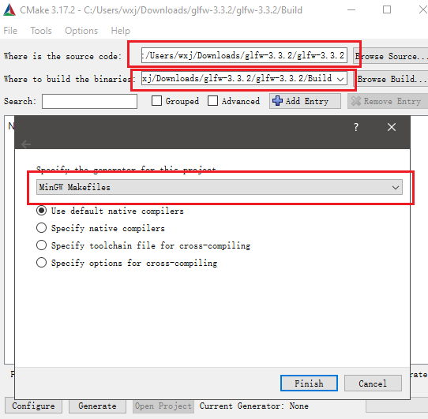
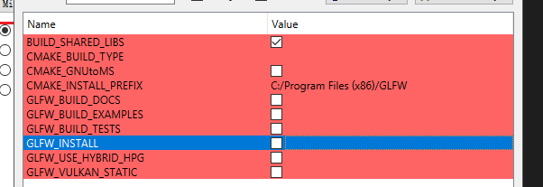
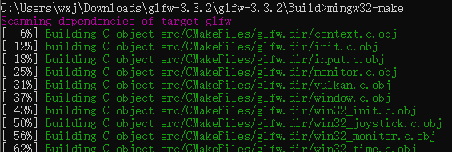
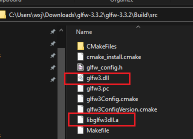
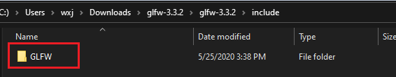

---
tags:
    - Library
created: 2022-02-24
updated: 2022-03-11
---

GLFW 库主要为创建系统窗口 / 渲染上下文，处理用户输入等功能提供了简单的API。

# 源码编译

从[官网](https://www.glfw.org/download.html)中下载GLFW源文件，然后再下载并安装[CMake](https://cmake.org/download/)软件，如使用 [Chocolatey](../Tools/Chocolatey.md)，可直接通过 `choco install --yes cmake` 进行安装。

安装Cmake后，按下图进行配置，从上到下三个红框分别表示，GLFW的源代码地址，编译后结果的输出地址以及编译对象，这里编译对象以 `MinGW Makefiles`作为示例。其中第三个红框的窗口时通过按左下角的`Configure`按钮呼出的。



```ad-warning
选择 MinGW Makefiles 必须保证 MinGW已经安装，且 /bin/mingw32-make 文件存在，建议安装64位 [MinGW](http://www.mingw-w64.org/doku.php)
```

配置完成后，勾选上最上面的BUILD_SHARD_LIBS选项后点积Generate按钮。



输出后，进入输出结果的地址，并通过mingw32-make命令进行编译，如下：


完成后进入src文件夹，其中的glfw3.dll和libglfw3dll.a即为所需要的静态链接文件。



而需要的头文件，则在glfw3的源代码路径下的include文件夹中



# Windows 预编译二进制文件

从官网中选择 `64/32-bit Windows binaries`，其中会包含各编译器所依赖的库文件，如 Visual Studio 2022 依赖的库存放在 `glfw-<version>.bin.WIN64\glfw-<version>.bin.WIN64\lib-vc2022` 文件夹下

