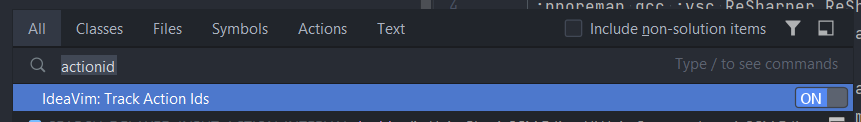
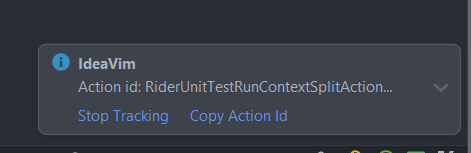

# 插件

## 安装本地插件

对于一些过时或未上架 Idea 商城的插件，可以通过如下方式安装本地插件：

## Ideavim

### ideavimrc

路径 `C:\Users\wxj\.ideavimrc`

### actions

可以通过 `IdeaVim: Track Action Ids` 开启追踪 Action Id 的窗口：

此时当执行一个操作后，在界面的右下角会显示这个操作的 ID，如下所示：

## Relative Number

# Reference
