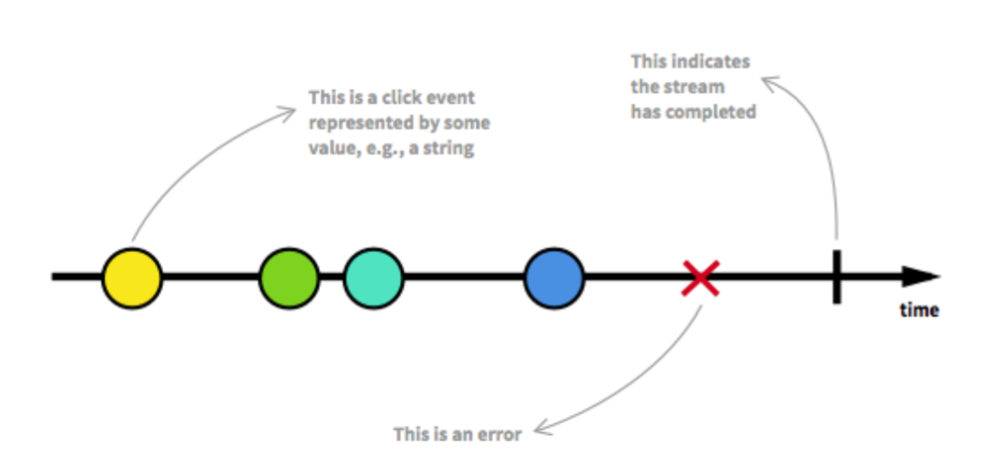

---
tags:
    - Unity
    - Reactive-Programming
created: 2021-12-30
updated: 2022-01-23
---
# Overview

`Reactive Programming` 是基于异步数据流的编程方式。异步数据流并非新鲜事物，如点击事件就是一种异步的事件流。 Reactive 只是将这种思想扩展到任何事物上。

对于异步数据流，本质上就是在时间线上一系列有序的事件。对于“事件”，可以是三种类型：数值（Value），错误（Error），完成信号（ Completed Singnal）。如下为一个点击事件流：



对于上述的事件流，也可以以如下的字符表示：

```cpp
--a---b-c---d---X---|->
```

其中：

-   `a, b, c, d` 表示数值
-   `X` 表示错误
-   `|` 表示完成信号
-   `----->` 表示时间线

对于这个数据流中的三种类型，分别需要定义函数去 `监听（Subscribing）`。这些监听的函数称为 `Observers` ，而被监听的流称为 `Subject` 或 `Observable` 。

```ad-note
Reactive Programming 本质上是观察者模式
```

Reactive 还引入了一系列监听函数，帮助处理异步数据流，如 `map`，`scan` 等等。这些监听函数会产生新的数据流，而不会影响之前的数据流，这种特性称为 `Immutability` 。

如下为一个点击数据流，通过 `map` 将点击事件流转换为数字流（每一个点击事件转为数字 1 ），再通过 `scan` 累加这些数字，将数字流转换为当前点击次数的数据流：

```cpp
clickStream: ---c----c--c----c------c-->
               vvvvv map(c becomes 1) vvvv
               ---1----1--1----1------1-->
               vvvvvvvvv scan(+) vvvvvvvvv
counterStream: ---1----2--3----4------5-->
```

如下为使用这种思路创建一个多次点击的事件流的图解：


其中，先使用 `buffer(stream.throttle(250ms))` 将点击流根据 250ms 结合在一起，再通过 `map` 将结合后的点击流转换为点击次数，最后通过 `filter` 筛选出点击此时大于等于 2 的双击流。

# Reference

[The introduction to Reactive Programming you've been missing (github.com)](https://gist.github.com/staltz/868e7e9bc2a7b8c1f754)
