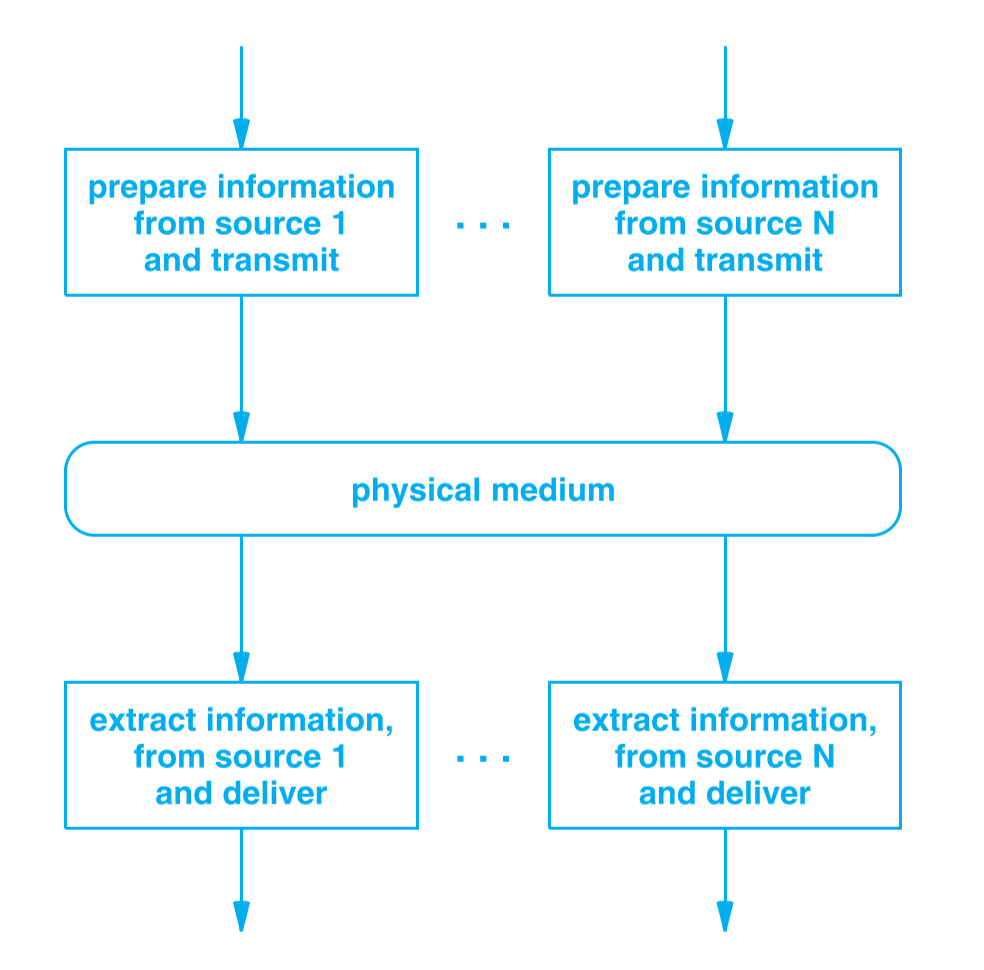
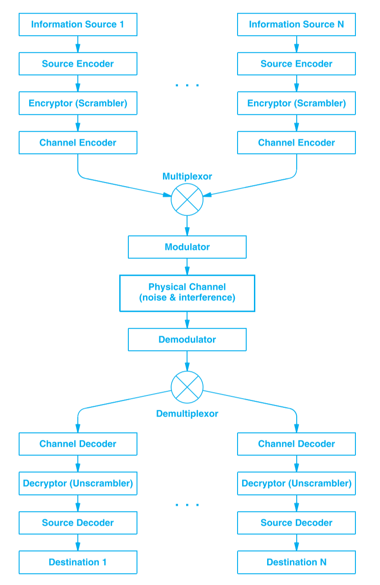

# Introduction

这一章主要是分析通过物理媒介进行信息传递的方法，例如线，光和无线电波等。这些方式在一些细节上不同，但所有方法的基本原理是相通的。

这一章同样会阐述一些在理论上可行，但在实际中因为现实世界的物理限制无法实现的方法。

# The Essence Of Data Communications

数据通信是物理，数学和电气工程三个学科的混合领域。

1. 物理：信息的传输依赖于物理媒介
2. 数学：信息需要数字化
3. 电气工程：数据传输需要构建现实中的通信系统

# Motivation And Scope Of The Subject

在数据通信领域有三个重要的点，他们定义了数据通信的一些领域

1. 传输的数据可以是任意类型的
   
   传输的数据并不一定是存储在计算机中的`bit`数据，也可以是从现实世界中获取的信息，如音频和视频。

2. 数据的传输依赖于物理系统

   数据是基于物理现象来传输的，例如电，电磁波。了解为什么这些物理现象可以被用来传输数据是很重要的。另外也需要理解物理系统的限制，因为这些限制引发的问题和这些问题如何被检测并解决。

3. 多个来源的信息可以共享基础媒介来传输

   媒介共享在计算机网络中是一个重要角色。了解哪些基础设施是可以被共享的，共享他们的优缺点，以及基于共享而设计的通信模型是很重要的。

# The Conceptual Pieces Of A Communications System

每一个来源都需要一些方法来获取信息，调整信息为用于传播的模式，使用共享的物理媒介来传输信息。同时也需要一些方法从物理媒介中抽取出每条信息的目的地地址，并将信息传送给目标地址。整个过程如下图所示：

上图是一个非常简化的模型，在实际操作中，在传输数据前，必须对数据进行数字化，也需要加入一些额外的信息防止错误发生。如果考虑到隐私，可能还需要进行加密。在使用共享媒介时，还要保证有方法可以分辨出每条信息且他们不会相互干扰。

为了解释数据通信的每个部分，工程师们制订了一个概念框架来说明通信系统中的每个小主题是如何联系在一起的，概念框架如下图所示：

# The Subtopics Of Data Communications

上一节中的概念框架图中的每一部分都代表了数据通信中的一个小主题。这一节中简单介绍了图中的一些术语，之后的几章中会在对每一部分进行详细说。

1. `数据来源(Information Sources)`可以是模拟数据或者数字电路。这一部分的关键内容包括信号的特征（`振幅(Amplitude)`，`频率(Frequency)`，`相位(Phase)`），周期性与非周期性，以及模拟信息和数字信息的转换。

2. `信源编码与解码(Source Encoder and Decoder)`。一旦信息被数字化后，信息就可以被转换，这一部分的关键内容包括数据压缩以及压缩后对于传输的影响

3. `加密与解密(Encryptor and Decryptor)`。为了保护信息和保证其可信度，在信息传送前需要进行加密，在接收后需要解密。这一部分的关键内容包括密码学技术与算法。

4. `信道编码与解码(Channel Encoder and Decoder)`。信道编码是用来检测也纠正传输错误。这一部分的关键内容包括检测和限制错误，以及实际应用的技术，如奇偶校验(parity checking)等。

5. `复用与解复用(Multiplexor and Demultiplexor)`。复用是指让多个来源的信息结合在一起并保证可以使用同一个媒介传输的方式。这一部分的关键内容包括介绍同时复用以及分时复用的技术。

6. `调制与解调(Modulator and Demodulator)`。调制是指让用电磁波传递信息的方式。这一部分的关键内容包括模拟信息与数字信息的调制方式，用来进行调制与解调的设备。
7. 
8. `物理通道与传输(Physical Channel and Transmission)`。 这一部分的关键内容包括传输媒介与传输方式（如并行，串行），带宽，噪声，干扰，信道容量，

