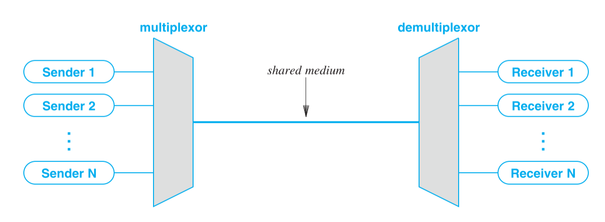
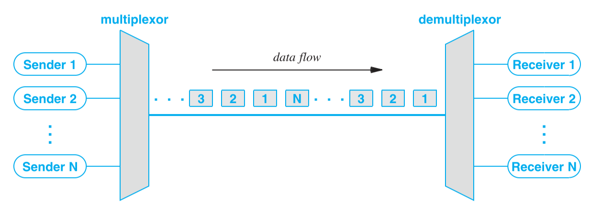
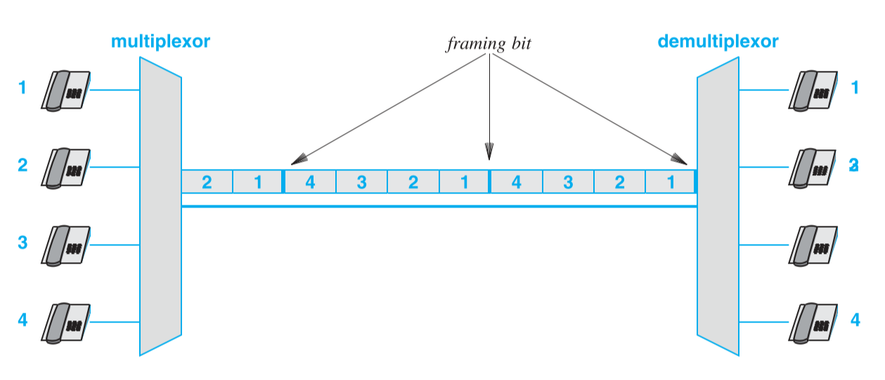
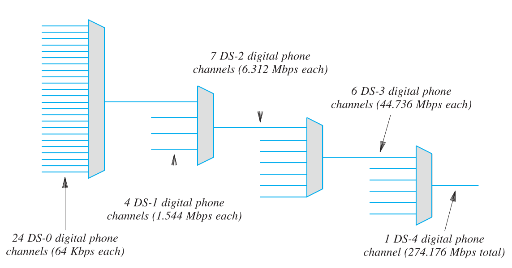
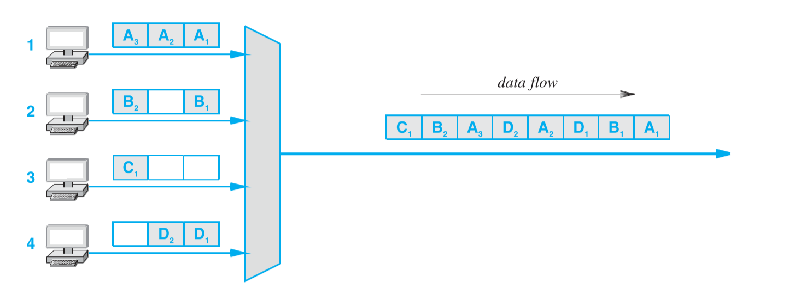

# Introduction

这一章介绍复用的概念，包括为什么要复用，复用的类型等。

# The Comcept Of Multiplexing

`复用(Multiplexing)`是将多个信源的数据流合并在一起，并通过一个共享的媒介进行传输。`复用器（Multiplexor）`是用来进行复用的设备。`解复用（Demultiplexing）`是将合并后的数据流拆分还原成一个个信源的信息，`解复用器（Demultiplexor）`是用来进行解复用的设备。下图是复用与解复用的使用简图：

复用与解复用在日常的计算机网络使用中一直在进行，如多台电脑使用同一根网线等。

# The Basic Types Of Multiplexing

在物理层，有四大类的复用方式：

1. 频分复用（Frequency Division Multiplexing）
2. 波分复用（Wavelength Division Multiplexing）
3. 时分复用（Time Division Multiplexing）
4. 码分复用（Code Division Multiplexing）

频分复用和波分复用使用比较广泛。波分复用可以看作是频分复用的一种特殊形式（波长与波的频率是相关的），波分复用用于光纤中。码分复用是没有使用物理特性，而是用数学原理，在一些电话系统中有运用。

# Frequency Division Multiplexing（FDM）

`频分复用（Frequency Division Multiplexing）`是无线电广播的基础。在频分复用下，一个有大频率带宽的信道将拆分成许多小部分，每个信源都有一个自己单独的信道（占据一定频率的范围，相当于每个信源的载波频率都不同），每个信道间不会相互干扰，所有的信源都将使用一个共同的媒介进行传输。在频分复用下，每个信道都可以选择各自的方式进行调制。

频分复用最大的优点在于多个发送端和接收端都可以同时使用传输媒介。

为了避免在频分复用下，每个信源都有自己的信道，如果这些信道间的频率太过于接近则会产生干扰。为了避免干扰的的产生，信道之间需要由间隔（Gap），称为`防护频带（Guard band）`。

下图是频分复用的示意图，每个小块代表一个可供信源使用的单独信道，可以看到每个信道间都有一个小间隔作为防护频带。

# Using A Range Of Frequency Per Channel

在上节的例子中，每个信道都有一个频率范围，但载波是固定频率的，信道之所欲选择一个频率范围而非单一的频率，主要是考虑便捷性，因为划分出的信道可能会以各种方式被使用。大多数频分复用系统都给发送端和接收端一个频率范围，系统可以选择最适用的频率作为载波，选择的评判标准通常是数据速率和对噪音的敏感性。

因为频分复用通常的频率较高，对噪声敏感，因此通常使用同轴电缆来作为传输媒介。

有的时候为了进一步增加数据速率，被分配给一个信源的信道会被再次的分割成更小的信道，如一个信源将分配给它的信道再分割成$K$个小信道，则每个小信道只要传输$1/k$的数据即可，这技术称为`子信道（Subchannel）`。

有的时候为了进一步增加对噪声的抵抗性，会使用称为`展频(Spread Spectrum)`的技术。这个方法同样将信源的信道再切割成$k$个小信道，但每个信道都传输一样的数据，接收端收到信息后，从这$k$个小信道中找寻错误最少的数据作为接收数据。

# Hierarchical FDM

`分层频分复用（Hierarchical FDM）`是将频分复用后的总数据再作为一个频率更高的频分复用的输入进行再次复用。如下图所示：

虽然上图中每一级的单一信道带宽是上一级所有信道带宽的总和。但在实际运用中，下一级的单一信道带宽是要略大于上一级所有信道带宽的总和的，因为还需要携带额外的同步帧。

# Wavelength Division Multiplexing（WDM）

`波分复用（Wavelength Division Multiplexing，WDM）`是在使用光纤作为媒介时的频分复用。当波分复用使用了许多不同频率的光时，可称为`密集波分复用（Dense Wavelength Division Multiplexing）`。

波分复用的原理可以参考物理上的三棱镜实验，即白光可以拆分为不同颜色的光，而光的颜色是由光的频率决定的。棱柱为波分复用与解复用提供了基础。波分复用的复用器是接受一系列不同波长的光，然后通过一个棱柱将它们合并成一束光，然后接收端的解复用器再次通过棱镜将它们还原成不同波长的光。示意图如下：

# Time Division Multiplexing（TDM）

`时分复用（Time Division Multiplexing，TDM）`的原理很简单，即每个信源使用共同的媒介一段时间，然后供下一个信源使用。示意图如下：

# Synchronous TDM

时分复用在计算机网络中是一个比较宽泛的概念。因此在实际运用中，上节中的概念图会在细节上有变化。例如有些时分复用系统并不是所有信源按顺序一个个发送。有些时分复用的系统中，每个信源发送间也并不像上图一样有时间间隔，一个信源发送后另一个信源会马上发送，这种系统称为`同步时间复用系统（Synchronous TDM）`。如下图所示：

# Framing Used In The Telephone System Version Of TDM

如之前所述，电话系统的两端是模拟信号，中间传输的是数字信号。对于中间使用同一个媒介传输的数字信号是通过同步时间复用系统来进行复用的。在电话系统中在时间复用系统中用了一个特殊技术来保证接收端和发送端的时间是对齐的，因为一旦接收端的时间出现了偏差，则可能将错误的信号传递给错误的目的地。为了解决这个问题，电话系统中的时间复用系统需要额外传输一个`信道帧（Framing Channel）`来表示一轮传输的开始，如下图所示：

# Hierarchical TDM

如同频分复用，时间复用也可以是分层的。不同的是，在频分复用系统中，每一级增加的是频率，在时分复用系统中每一级增加的是数据速率（减少时间切分间隔）。另外每一级的数据速率略大于前一级所有数据速率的总和，这是因为要传输额外帧数据。分层时间复用如下图：

# The Problem With Synchronous TDM: Unfilled Slots

同步时间复用对与每个信源都平均的提供时间，即将整个信道的容量（容量可看作一秒能传输的数据量）平分。但如果一个信源在某一段是空白数据，那么当轮到这个信源发送数据时，只能往信道内填空白数据（通常填0），且额外增加一位表示该数据是无效的，而不是正好全是0。这样会造成信道容量的浪费。如下图所示：

# Statistical TDM

为了解决同步TDM这个问题，有个称为`统计时间复用（Statistical TDM）`，或称为异步时间复用（Asynchronous）的技术。这个技术仍然是所有信源轮询的传输数据，但是当信源没有数据时，并非像同步时间同步那样装填空白数据，而是直接跳过。如下图所示：

尽管这个方法解决了空白数据造成的信道容量浪费，但需要引入额外的数据来表明每个数据块是哪个信源的。

# Inverse Multiplexing

`逆复用（Inverse Multiplexing）`技术是用类似于复用的思维方式，但解决是只有两个信源，但其中有多个传输媒介，且两信源有大量的数据需要传输，但中间媒介没有一个有足够的足够的比特率。逆复用技术就是将原数据拆分成多份，然后通过中间的低容量媒介进行传输，最后在接收端再将数据合并在一起。示意图如下图所示：

虽然逆复用看着很像复用的反向使用，即将复用的输出端变成输入，输入端变成输出，但在实际使用时，不能简单的将复用器反向设计得到逆复用器。逆复用器在发射端必须考虑如何将数据拆分后分配给多个低速率媒介。在接收端也必须考虑多个媒介的传输速率不同，可能造成某些媒介中的数据到达特别缓慢，这时候该如何处理。

# Code Division Multiplexing

`码分复用（Code Division Multiplexing）`是在蜂窝电话（Cellular telephone）和卫星通信中使用的复用方法。与频分复用和时分复用不同的是，码分复用并不依赖与物理特性，而是利用数学特性：两个正交的线段可以被结合在一起而不会互相干扰。

每个信源都有一个不同的二进制码$C_i$，每个信源的二进制码都必须与其他信源的二进制码正交。即将这些二进制码看作是线段（1保持1，0看成-1），这些线段间必须两两垂直。每个信源都将原数据与二进制码叉乘，然后传输结果，复用的过程即是将所有的结果都累加在一起，在接收端每个信源的目的地再相应的将接受到的复用数据再次与对应信源的二进制码点乘，结果即为该信源应该收到的数据。

下面以一个例子方便理解。

假设有两个信源，两个信源的$C_i$分别是$(1,0)和(1,1)$，需要传输的数据分别是$(1,0,1,0)$和$(0,1,1,0)$。传输过程如下：

将原数据和二进制码改为向量，即1为1，0变-1。
信源1：$C_1=(1,-1)$，$V_1=(1,-1,1,-1)$
信源2：$C_2=(1,1)$，$V_2=(-1,1,1,-1)$

可以看到$C_1$和$C_2$是正交的。

复用过程即为:
$$
(C_1 \times V_1) + (C_2\times V_2)= \\\\
((1,-1),(-1,1),(1,-1),(-1,1))+((-1,-1),(1,1),(1,1),(-1,-1))\\\\
=((0,-2),(0,2),(2,0),(-2,0))
$$

((0,-2),(0,2),(2,0),(-2,0))即为复用后的结果。

对于信源1的接收端而言，解复用过程为：

$$(1,-1)\cdot((0,-2),(0,2),(2,0),(-2,0))\\\\
=((0+2),(0-2),(2+0),(-2+0))\\\\
=(2,-2,2,-2)
$$

负数变为0，正数变为1，即接收端1收到数据为(1,-1,1,-1)，与信源1发送数据相同。

对于信源2的接收端来说，解复用过程如下：

$$(1,1)\cdot((0,-2),(0,2),(2,0),(-2,0))\\\\
=((0-2),(0+2),(2+0),(-2+0))\\\\
=(-2,2,2,-2)
$$

负数变为0，正数变为1，即接收端2收到数据为(-1,1,1,-1)，与信源2发送数据相同。

上述例子中，每个信源的二进制码$c_i$都比较小，但在实际运用中$c_i$可能会很大，这就导致了计算量的上升。如果数据本身并不多，但是花费了大量时间计算，效率比较低，因此在数据量不高的网络中CDM并不适用，

但是高数据量网络中，码分复用非常常见，因为相对于时间复用，码分复用的延迟较低。因为码分复用可以将多个信源的数据一次性同时发送给发送端，而时分复用则必须等待轮询到自己才能发送一部分。

