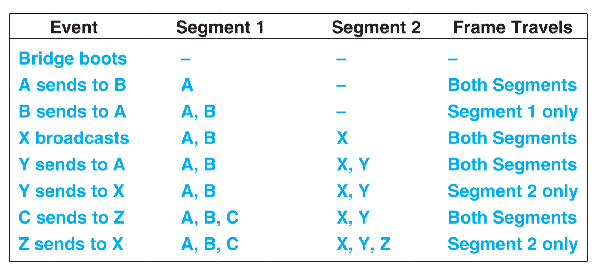
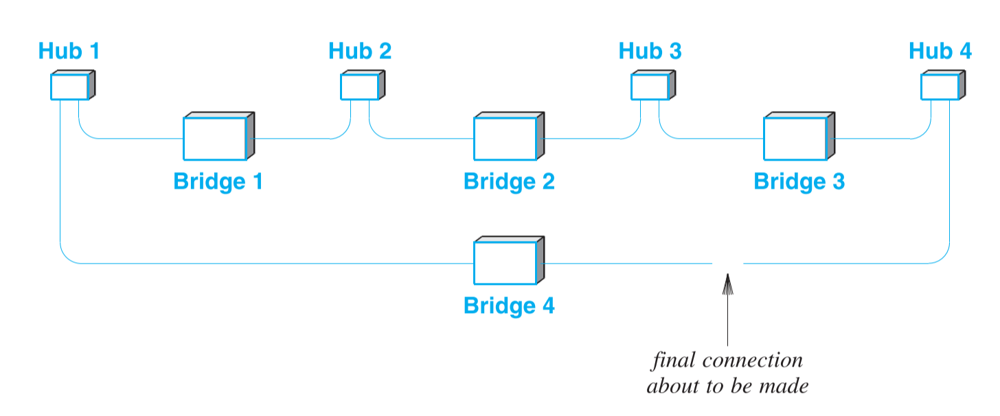
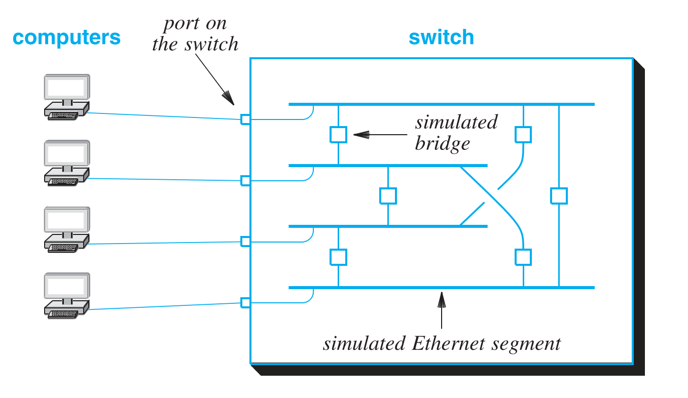
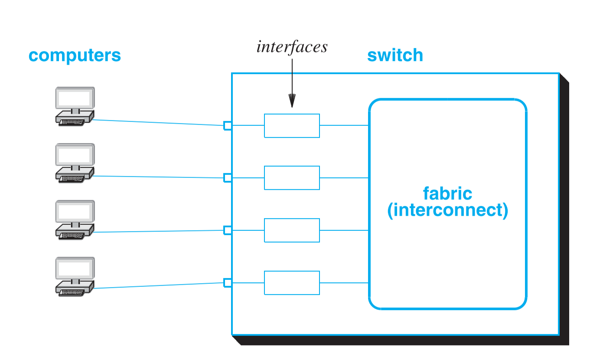

# Introduction

这一章会介绍关于扩展LAN的方法，如中继器（Repeaters）和网桥（Bridges），也会介绍在网桥存在循环时解决死循环的`生成树算法(Spannning tree algorithms)`。最后会讨论交换机和网桥之间的关系。

# Distance Limitation And LAN Design

距离限制是LAN计算的核心，工程师们需要从最大延迟，信道容量和传输距离间做权衡。因为LAN中的硬件设备的发送功率是固定的，所以如果两个设备之间的电缆长度增加，其中的信号强度就会减弱，导致错误的发生。

# Fiber Modem Extensions

解决LAN距离的方法通常不是增加信号的强度也不是增加电缆，而是增加额外的硬件设备来转播信号。

最简单的LAN扩展方法是通过一根光纤和一堆光纤调制解调器，如下图所示：

一个光纤调制解调器与计算机设备连接，另一个光纤调制解调器与通向以太网的交换机或集线器连接，两个光纤调制解调器用光纤连接。这样计算机设备就能与以太网进行连接。

# Repeaters

中继器（Repeaters）是一个用来传播LAN信号的模拟设备，中继器并不理解包和Bit数据，它只是将接受到的信号放大再传播出去。

一个中继器的典型应用就是使用遥控器控制其他房间的设备，将中继器放置在另一个房间，在遥控器所在房间，将Sensor通过线缆与中继器相连。当本房间的Sensor搜到信号后，信号后传输给中继器，中继器放大后传播出去，另一个房间的设备就会收到，如下图所示：

# Bridges And Bridging

网桥（Bridges）是连接两组LAN设备（如两个集线器）并且在它们之间传输包的方法。网桥是以混杂模式监听每组LAN设备，即数据发送给其下的任意一个设备，该数据都会被网桥检测到。因此，被网桥连接的两组设备表现如同是一组设备，即一组中的设备可以发送数据给另一组设备，且当一个设备广播时，两组设备中的所有设备都能接受到。而在网桥下的设备是无法区分自己是在一个单一的一组设备下（如只是在集线器下）还是在网桥下。

* 这里将书中描述的Segment翻译为一组设备，如一个集线器下的设备。

网桥连接的示意图如下：

# Learning Bridges And Frame Filtering

虽然网桥是以混杂模式监听，且可以让两组设备表现的如同在同一组，但是网桥并不会盲目的将数据从一组设备传递给另一组。网桥监听到数据后会针对包的目标MAC地址过滤数据，仅将数据发送给需要的一组设备。当让，在广播或者多播模式下，网桥直接将数据发送给两个设备的，以保证广播或者多播的正常运行。

大多数网桥被称为自适应网桥（Adaptive/Learning Bridges），因为他们可以自动识别出每个设备是处于哪个分组下。当一个数据包经过网桥时，网桥会读取源地址，然后判断两组设备列表中是否有该发送设备，如果没有，则将发送设备放在符合的设备列表下。同时也会读取目标地址，决定数据需要发送给哪部分设备，如果目标地址在两组设备列表中都不存在，则两组设备都会收到网桥的转发的数据。

下表是发送网桥发送数据的例子。在第一行即网桥启动时，两组数据的列表都是空的。第二行即数据从A设备发送给B设备，此时先检测出将发送端A是在Segment1中，但此时B不在任何列表中，所以数据会发送给两个部分。第三行即数据从B设备发送给A设备，先检测出发送端B设备是再Segment1中，而A也在Segment1种，所以数据只要在Segment1中传输即可。同理可以分析其他的发送数据。

# Why Bridging Works Well

当网桥知道其下的所有设备处于哪个部分后，数据在网桥之间的传输效率要大于数据在真正的单一分组中的传输。

以上节中的示意图为例，当网桥知道所有的设备处于哪个部分后，如果数据从A发送给B，那么数据只要在Segment1中传输，同理如果数据从X发送给Y，数据只要在Segment2中传输。因此，这两个传输行为是可以同时进行的，因为它们都只是发生在各自的部分中。而如果所有设备都是在一个真正的单一分组下，即A，B，X，Y是共享一个媒介传输，两个传输行为也就不可能同时发生。

因此可以将设备分组后，用网桥连接来增加数据传输的效率。

# Distributed Spanning Tree

如果一系列设备如下图所示连接（每个HUb下有多个设备，图中未展现）：

可以看到图中的设备形成了一个循环，在这种情况下广播的数据会发生死循环。因为网桥收到广播数据后会直接向前传递，而在网桥形成循环后，每个网桥的直接向前传递就会导致信息始终在循环中传输。

为了解决这个问题，电子设备协会（Digital Equipment Corporation）在1985年为以太网设计了一个称为`生成树协议（Spannning Tree Protocol,STP）`的方法。STP方法是通过算法从一系列网桥STP计算出一个`分布生成树（Distributed Spanning Tree）`。协议规定如果将包的广播地址设为`01:80:C2:00:00:00`即表示使用STP方法。STP方法的步骤如下：

1. 先找到一个网桥作为根。
   
   每个网桥都有一个ID地址，算法将ID最小的网桥作为根。

   每个网桥的ID地址都由两部分组成，第一部分是16bit长的可配置优先级数字，第二部分是48bits长的MAC地址。当比较ID地址时，会首先判断第一部分，在第一部分相同的情况下判断第二部分。因为第一部分是可配置的，所以管理员是可以指定某一个网桥作为根的。

2. 最短路径计算
   
   每个网桥都计算自己与根网桥的最短路径。

3. 传递数据
   
   网桥之间的数据传递，只能由最短路径传输。

在上图展示的循环中，如果Hub1广播数据，那么Hub4收到数据的通路就是$Hub1->Hub4$，而更长的路径，如$Hub1->Hub2->Hub3->Hub4$就会被禁止，因此更长的循环路径也同样会被禁止。

# Switching And Layer 2 switchers

`桥接（bridging）`的概念可以帮助理解现代以太网的基础：`交换（switching）`。一个以太网交换机（Ethernet switch）有时也被称为二层交换机（Layer-2 switch）。交换机如同集线器一样，有多个接口，每个接口都与一个计算机相连。交换机和集线器的不同在于，集线器如模拟设备一样，是将电脑传输的信号传递出去，而交换机是数字设备，传递的是电脑的数据包。可以将集线器想象成一个共享媒介，而把交换器想象成一个由网桥连接的网络，其中每个部分都只有一台电脑。

交换机可以想象成如下图的结构，可以看到交换机的左侧是三个网桥，每个网桥连接两个设备：

但上图只是一个概念图，实际中的交换机中并没有网桥，而是每个端口都于一个`智能接口（Intelligent Interface）`相连，然后有个中央光纤将所有的接口连接在一起，而且这光纤支持两两配对的接口间的同时传输（如之前提到的网桥连接的两部分间的设备可同时传输一样）。

每个智能接口都有处理器和内存，因此可以判断需要传递的路线以及在目标端口繁忙时缓存数据，如电脑1和电脑2同时要向电脑3传输数据，则电脑1或电脑2中的一台会先将要传输的数据缓存起来。实际的交换机结构如下：

交换机相对于集线器最大的优点在于并行。集线器在同一时间只能支持一个传输，而交换机可以同时进行多个独立的传输（这里的独立指不会有多个来自于不同地址的数据要发送给同一端口）。因此如果一个交换机有$N$个端口，最多可以有$N/2$个传输同时进行。

# VLAN Switchers

当一个交换机被扩展了虚拟功能，即称为虚拟局域网交换机（Virtual Local Area Network Switch,VLAN Switcher）。虚拟局域网交换机的功能就是让单一的交换机模拟成是多个独立的交换机，即管理者可以将一台交换机的其中某几个端口定义是在一个模拟局域网中，而另几个端口是在另外一个模拟局域网中，这样的话其中一个模拟局域网中的设备发送广播数据，另一个模拟局域网中的端口并不会接受到信息。

这种通过VLAN切分广播域的做法在公司环境下很关键，如一层楼只有一个交换机，但广播数据的发送并不希望整层楼都能收到。

# Multiple Switchers And Shared VLANs

交换机通常被部署在离计算机较近的地方，如每层楼都有一个交换机。在公司环境下有种情况是同一个部门可能处于不同的楼层，那么同一个部门的网络在不同的交换机下。在有多个交换机的情况下，上节中提到的VLAN会遇到问题。当只有一个交换机时，根据端口号分好VLAN后，数据的传输指定端口号就能判断出数据应该处于哪个VLAN中。但如果有两台交换机，两台交换机的同一端口，如端口1，可能是在不同的VLAN下，因此光指定端口号是无法知道其到底在哪个VLAN。

为了在多个交换机中使用VLAN技术，IEEE扩展了以太网协议，记录在$802.1Q$中。该协议下，在以太网的数据包的头字段中，增加16bit长的数据表示VLAN Tag，表示需要传递给VLAN。在802.1Q协议下的以太网数据包如下图所示：

即使是使用了多交换机的VLAN，$802.1Q$协议下的以太网数据包仅在交换机之间传输，而在交换机与电脑间传输的包仍然是普通以太网数据包，因为只有交换机才能解析$802.1Q$数据。使用$802.1Q$实现VLAN的交换机如下图所示

以上图为例，如果图中的A，B，D，E共处于VLAN 17中，当A广播数据后，B会直接收到数据，然后交换机1会将$17$作为VLAN Tag插入到数据包头中，然后传递给交换机2，交换机2在收到数据后，取出其中的VLAN tag，并将包传递给D和E。

# The importance Of Bridging

虽然现在很少会有厂商生产单独的网桥，但是桥接的概念已经被整合入网络设备中。如无线网络的路由器就整合了提供桥接功能的以太网的交换器，通常将其中交换机的端口称为`本地端口（Local Port）`，将连接网络调制解调器的端口称为`因特网端口（Internet Port）`。当两个本地的电脑传输数据时，无线路由器并不会将数据发送给网络服务商，而是直接将数据在本地进行传输（类似于桥接的分组功能）。
