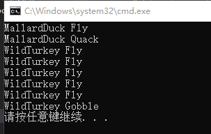
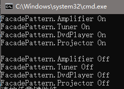
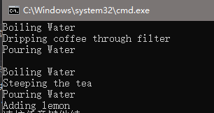
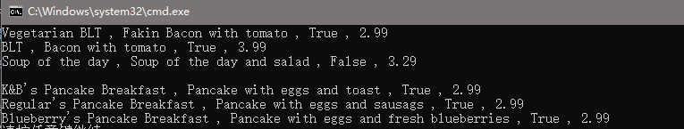
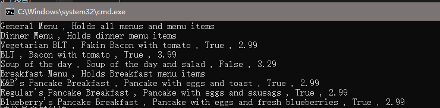


这一篇将会介绍单例模式，命令模式，适配器模式，外观模式，迭代器模式及组合模式。


<!--more-->

***

***

### 适配器模式

适配器模式（Adapter Pattern）将一个类的接口转换为用户想要的另一个接口。适配器模式将原先因为接口不兼容的一些类可以一起工作。

例如我们有已经实现的火鸡类和鸭子类，其中鸭子的鸣叫我们使用`Quack`，火鸡的鸣叫我们用`Goggle`，两个接口不相同，但在某些情况下，我们不希望具体区分是火鸡还是鸭子，只希望他们都能叫，这时候就需要用适配器模式，将火鸡或鸭子伪装成同一个类。

### 代码示例

#### 鸭子及火鸡抽象接口及实现

```cs 鸭子接口
public interface Duck
{
    void Quack();
    void Fly();
}
```

``` cs 鸭子实现
public class MallardDuck : Duck
{
    public void Fly()
    {
        Console.WriteLine("MallardDuck Fly");
    }

    public void Quack()
    {
        Console.WriteLine("MallardDuck Quack");
    }
}
```

```cs 火鸡接口
public interface Turkey
{
    void Gobble();
    void Fly();
}
```

```cs 火鸡实现
public class WildTurkey : Turkey
{
    public void Fly()
    {
        Console.WriteLine("WildTurkey Fly");
    }

    public void Gobble()
    {
        Console.WriteLine("WildTurkey Gobble");
    }
}
```

#### 适配器类
```cs 火鸡适配器
public class TurkeyAdapter : Duck
{
    Turkey turkey;
    public TurkeyAdapter(Turkey turkey)
    {
        this.turkey = turkey;
    }
    public void Fly()
    {
        for (int i = 0; i != 5; ++i)
            turkey.Fly();
    }

    public void Quack()
    {
        turkey.Gobble();
    }
}
```

### 测试代码及结果

```cs 测试代码
static void Main(string[] args)
{
    MallardDuck duck = new MallardDuck();
    WildTurkey turkey = new WildTurkey();
    TestDuck(duck);
    TestDuck(new TurkeyAdapter(turkey));
}

static void TestDuck(Duck duck)
{
    duck.Fly();
    duck.Quack();
}
```
运行结果：



## 外观模式

外观模式(Facade Pattern)为子系统的一系列接口提供了一个统一的，更高级别的接口以简化外部的调用。

外观模式实际上是遵从于`最小知识原则`，对一些上层的类来说，它不需要了解下面子系统的具体构成，那么我们就用一个中间层（Facade）来将封装这些子系统，形成一个软解耦。

例如我们有一个家庭影院，在播放电影时我们需要打开DVD机，打开投影仪，打开放大器，打开音频协调器等，我们可以用一个`Facade`来将这些操作都封装起来，对于外部调用者来说仅有开始播放电影及关闭播放电影两步。

### 代码示例

#### 子系统

```cs DVD机器
public class DvdPlayer
{
    public void On()
    {
        Console.WriteLine(this.GetType().ToString() + " On");
    }

    public void Off()
    {
        Console.WriteLine(this.GetType().ToString() + " Off");
    }
}
```

```cs 投影仪
public class Projector
{
    public void On()
    {
        Console.WriteLine(this.GetType().ToString() + " On");
    }

    public void Off()
    {
        Console.WriteLine(this.GetType().ToString() + " Off");
    }
}
```

```cs 放大器
public class Amplifier
{
    public void On()
    {
        Console.WriteLine(this.GetType().ToString() + " On");
    }

    public void Off()
    {
        Console.WriteLine(this.GetType().ToString() + " Off");
    }
}
```

```cs 音频协调器
public class Tuner
{
    public void On()
    {
        Console.WriteLine(this.GetType().ToString() + " On");
    }

    public void Off()
    {
        Console.WriteLine(this.GetType().ToString() + " Off");
    }
}
```

#### Facade

```cs 家庭影院外观者
class HomeTheaderFacade
{
    private Amplifier amplifier = null;
    private Tuner tuner = null;
    private DvdPlayer dvdPlayer = null;
    private Projector projector = null;

    public HomeTheaderFacade(Amplifier amplifier, Tuner tuner, DvdPlayer dvdPlayer, Projector projector)
    {
        this.amplifier = amplifier;
        this.tuner = tuner;
        this.dvdPlayer = dvdPlayer;
        this.projector = projector;
    }

    public void WatchMovie()
    {
        amplifier.On();
        tuner.On();
        dvdPlayer.On();
        projector.On();
    }

    public void endMovie()
    {
        amplifier.Off();
        tuner.Off();
        dvdPlayer.Off();
        projector.Off();
    }
}
```

### 测试代码及结果

```cs 测试代码
HomeTheaderFacade facade = new HomeTheaderFacade(new Amplifier(), new Tuner(), new DvdPlayer(), new Projector());
facade.WatchMovie();
Console.WriteLine();
facade.endMovie();
```

运行结果：



***

## 模版方法模式

模版方法模式（Template Method Pattern）定义了一个算法的操作步骤，但其中的某些步骤需要派生来对应实现。

* 工厂方法>模式就是模版方法模式的一种运用。

* 策略模式和模版方法模式都是将算法的实现抽象出来，不同的是策略模式的实现依靠组成，而模版方法模式依靠继承。

例如我们需要准备咖啡和茶，准备咖啡基本步骤为烧开水，加入咖啡粉，将咖啡倒入杯子，增加牛奶或糖（可选），准备茶的基本步骤为烧开水，加入茶粉，将茶倒入杯子，增加柠檬（可选）。我们发现在制作两个饮料的过程中，烧开水和倒入杯子这两个步骤是一样的，剩下的两个步骤，向烧开的水中增加相应的粉和增加配料，这两部分也是类似的，于是我们可以用模版方法模式，将这两步骤作为抽象方法。

### 代码示例

#### 算法模版基类

```cs 咖啡因饮料模版
public abstract class CaffeineBeverage
{
    public void PrepareRecipe()
    {
        boilWater();
        brew();
        pourInCup();
        if (NeedCondiments())
            addCondiments();
    }

    protected abstract void brew();

    protected abstract void addCondiments();

    private void boilWater()
    {
        Console.WriteLine("Boiling Water");
    }

    private void pourInCup()
    {
        Console.WriteLine("Pouring Water");
    }

    public virtual bool NeedCondiments()
    {
        return true;
    }
}
```


例子中`brew`和`addCondiments`即为模版函数，而`NeedCondiments`这种提供了基本实现，但派生类中仍然可以重写的函数被称为钩子（`Hook`）。


#### 咖啡因饮料实现

```cs 咖啡
public class Coffee : CaffeineBeverage
{
    protected override void addCondiments()
    {
        Console.WriteLine("Add sugar and Milk");
    }

    protected override void brew()
    {
        Console.WriteLine("Dripping coffee through filter");
    }

    public override bool NeedCondiments()
    {
        return false;
    }
}
```

```cs 茶
class Tea : CaffeineBeverage
{
    protected override void addCondiments()
    {
        Console.WriteLine("Adding lemon");
    }

    protected override void brew()
    {
        Console.WriteLine("Steeping the tea");
    }
}
```

### 测试代码及结果

```cs 测试代码
Coffee coffee = new Coffee();
Tea tea = new Tea();
coffee.PrepareRecipe();
Console.WriteLine();
tea.PrepareRecipe();
```

运行结果:



***

## 迭代器模式

迭代器模式(Iterator Pattern)提供了一种访问聚合对象但不需要关心其内部实现方法的方式。

例如我们存在两个菜单，第一个菜单表示早餐，第二个表示晚餐，第一个菜单其中的菜品用`List`来存储，第二个菜单其中的菜品用`Array`来存储。在这种情况下就需要使用迭代器模式，为两个菜单提供一个供外部调用的访问菜品的接口。

### 代码示例

我们在两个菜单类中添加`createIterator`函数来返回迭代器，对于外部调用者，如测试代码中的`PrintMenu`,它只需要调用`hasNext`及`next`即可而不需要关心菜单中的具体实现。

#### 菜单

```cs Pancake菜单
public class PancakeHouseMenu
{
    private List<MenuItem> menuItemsList = null;

    public PancakeHouseMenu()
    {
        menuItemsList = new List<MenuItem>();
        addItem("K&B's Pancake Breakfast", "Pancake with eggs and toast", true, 2.99f);
        addItem("Regular's Pancake Breakfast", "Pancake with eggs and sausags", true, 2.99f);
        addItem("Blueberry's Pancake Breakfast", "Pancake with eggs and fresh blueberries", true, 2.99f);
    }

    public Iterator createIterator()
    {
        return new PancakeIterator(menuItemsList);
    }

    public void addItem(string name, string description, bool vegetarian, float price)
    {
        MenuItem menuItem = new MenuItem(name, description, vegetarian, price);
        menuItemsList.Add(menuItem);
    }
}
```

```cs Diner菜单
public class DinerMenu
{
    private readonly int MaxItemsCount = 6;
    private MenuItem[] menuItemsArray = null;
    private int numberOfItems = 0;

    public DinerMenu()
    {
        menuItemsArray = new MenuItem[MaxItemsCount];
        addItem("Vegetarian BLT", "Fakin Bacon with tomato", true, 2.99f);
        addItem("BLT", "Bacon with tomato", true, 3.99f);
        addItem("Soup of the day", "Soup of the day and salad", false, 3.29f);
    }

    public void addItem(string name, string description, bool vegetarian, float price)
    {
        if (numberOfItems >= MaxItemsCount)
            return;
        MenuItem menuItem = new MenuItem(name, description, vegetarian, price);
        menuItemsArray[numberOfItems++] = menuItem;
    }

    public Iterator createIterator()
    {
        return new DinerMenuIterator(menuItemsArray);
    }
}
```

#### 迭代器接口及实现

```cs 迭代器接口
public interface Iterator
{
    bool hasNext();
    object next();
}
```

```cs 迭代器实现
public class PancakeIterator : Iterator
{
    private List<MenuItem> itemsList = null;
    private int currentPosition = 0;

    public PancakeIterator(List<MenuItem> itemsList)
    {
        this.itemsList = itemsList;
    }
    public bool hasNext()
    {
        return currentPosition < itemsList.Count && itemsList[currentPosition] != null;
    }

    public object next()
    {
        return itemsList[currentPosition++];
    }
}

public class DinerMenuIterator : Iterator
{
    private MenuItem[] itemsArray = null;
    private int currentPosition = 0;

    public DinerMenuIterator(MenuItem[] items)
    {
        this.itemsArray = items;
    }
    public bool hasNext()
    {
        return currentPosition < itemsArray.Length && itemsArray[currentPosition] != null;
    }

    public object next()
    {
        return itemsArray[currentPosition++];
    }
}
```

### 测试代码及结果

```cs 测试代码
static void Main(string[] args)
{
    DinerMenu dinerMenu = new DinerMenu();
    PancakeHouseMenu pancakeHouseMenu = new PancakeHouseMenu();

    PrintMenu(dinerMenu.createIterator());
    Console.WriteLine();
    PrintMenu(pancakeHouseMenu.createIterator());
}

private static void PrintMenu(Iterator iterator)
{
    while (iterator.hasNext())
    {
        ((MenuItem)iterator.next()).Debug();
    }
}
```
  
运行结果：



***

## 组合模式

组合模式（Composite Pattern）是用树形结构来组合对象进而体现一种局部-整体的层次结构。组合模式可以让调用者以统一的方式对待单个物体和多个物体的组合。

例如我们需要打印一个菜单上的所有菜品，但菜单中可能还包含子菜单，子菜单中又可能包含子菜单等等，但对于外部调用者而言则不希望关注这些细节。我们可以通过定义一个基类，无论是菜品还是菜单都继承自这个基类，这样对于菜单而言，无论是子菜单还是菜品都是同一个基类，可一起管理。对于外部调者而言只x需要关心这个基类即可。

### 代码示例

#### 共同抽象类基类

```cs 菜单元素
public abstract class MenuComponent
{
    public virtual void Add(MenuComponent menuComponent) { throw new NotImplementedException(); }
    public virtual void Remove(MenuComponent menuComponent) { throw new NotImplementedException(); }
    public virtual MenuComponent GetChild(int i) { throw new NotImplementedException(); }
    public virtual string Name { get; protected set; }
    public virtual string Description { get; protected set; }
    public virtual float Price { get; protected set; }
    public virtual bool Vegetarian { get; protected set; }
    public virtual void Debug()
    {
        Console.WriteLine(Name + " , " + Description + " , " + Vegetarian + " , " + Price);
    }
}
```

#### 菜单及菜品实现

```cs 菜单
public class Menu : MenuComponent
{
    private List<MenuComponent> menuComponetsList = null;

    public Menu(string name, string description)
    {
        menuComponetsList = new List<MenuComponent>();
        Name = name;
        Description = description;
    }

    public override void Add(MenuComponent menuComponent)
    {
        menuComponetsList.Add(menuComponent);
    }

    public override void Remove(MenuComponent menuComponent)
    {
        menuComponent.Remove(menuComponent);
    }

    public override MenuComponent GetChild(int i)
    {
        return menuComponetsList[i];
    }

    public override void Debug()
    {
        Console.WriteLine(Name + " , " + Description);
        menuComponetsList.ForEach(menuComponent => menuComponent.Debug());
    }
}
```

```cs 菜品
public class MenuItem : MenuComponent
{
    public MenuItem(string name, string description, bool vegetarian, float price)
    {
        Name = name;
        Description = description;
        Vegetarian = vegetarian;
        Price = price;
    }
}
```

### 测试代码及结果

```cs 测试代码
Menu menu = new Menu("General Menu", "Holds all menus and menu items");
Menu dinnerMenu = new Menu("Dinner Menu", "Holds dinner menu items");
Menu breakfastMenu = new Menu("Breakfast Menu", "Holds Breakfast menu items");
menu.Add(dinnerMenu);
menu.Add(breakfastMenu);


breakfastMenu.Add(new MenuItem("K&B's Pancake Breakfast", "Pancake with eggs and toast", true, 2.99f));
breakfastMenu.Add(new MenuItem("Regular's Pancake Breakfast", "Pancake with eggs and sausags", true, 2.99f));
breakfastMenu.Add(new MenuItem("Blueberry's Pancake Breakfast", "Pancake with eggs and fresh blueberries", true, 2.99f));

dinnerMenu.Add(new MenuItem("Vegetarian BLT", "Fakin Bacon with tomato", true, 2.99f));
dinnerMenu.Add(new MenuItem("BLT", "Bacon with tomato", true, 3.99f));
dinnerMenu.Add(new MenuItem("Soup of the day", "Soup of the day and salad", false, 3.29f));

menu.Debug();
```

运行结果：




引用：
1. https://design-patterns.readthedocs.io/zh_CN/latest/behavioral_patterns/behavioral.html


***