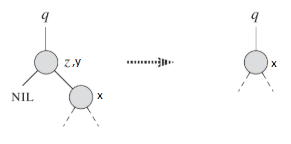
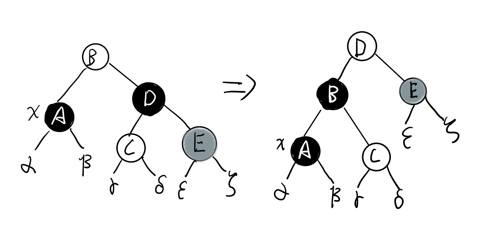

---
tags:
    - Algorithms
created: 2022-02-02
updated: 2022-02-02
---


红黑树是众多让二叉搜索树达到平衡的树形结构之一。树达到平衡可以保证动态操作，如删除，插入，搜索等，复杂度都为$O(lgn)$。

# Properties of red-black trees

红黑树是一种特殊的二叉搜索树，每个结点需要花费额外一个bit来存储结点的颜色信息，颜色为红或者黑。红黑树保证了整棵树，不会有一个路径是另一个路径的两倍长。

红黑树满足以下五个特性：

1. 所有结点要么是黑要么是红
2. 根节点是黑色的
3. 每个叶子（这里指NULL结点）是黑色的
4. 如果一个结点是红色的，那么他的两个子结点是黑色的（即不会有连续的两层是红）
5. 所有结点到任意叶子的简单路径上（不存在绕行）有相同的黑色结点数

将任意结点到叶子的路径上黑色结点的数目成为`黑高(black-height)`，表达为$bh(x)$。将一棵树的黑高定义为：根节点到叶子的黑高。

* 黑高的计算并不包含结点自己。例如，根节点必然是黑色的，但如果一棵树，只有根节点，那么他的黑高是0，因为根节点并不纳入黑高的计算。

用一个哨兵（用`T.nil`表示）来指代叶子结点（NULL），这样所有的叶子和根节点的父节点都为`T.nil`。

将除了叶子结点外的所有结点成为`内部结点(internal nodes)`，否则为外部结点`external nodes`




定理：一个有$n$个内部结点的红黑树，其高度最多为$2\lg (n+1)$



定理证明如下：

1. 首先需要证明定理：对于任意一个结点$x$，至少有$2^{bh(x)}-1$个内部子结点
   
   用推导法证明该定理：

   (1)如果结点`x`的高度是0，则`x`一定是叶子结点。其黑高为0，那么内部子节点为$2^0-1=0$，即0个内部子节点，满足

   (2) 如果结点`x`的高度不为0，且有两个子结点。根据特性5，可以推得如果这个子结点是红色，则这个子结点的黑高为$bh(x)$，如果子结点是黑色，则子结点的黑高为$bh(x)-1$。

   因为$x$的黑高为$bh(x)$，如果子结点是黑色的，则这个子结点本身提供了一个黑色结点，所以它的黑高只能为父结点黑高减1，即$bh(x)-1$，反之子结点是红色的，那么这个结点不提供黑色结点，他的黑高和父结点一样，为$bh(x)$

   所以结点$x$至少有 $2*(2^{bh(x)-1}-1) +1$个结点，这里两个子结点的各自内部子结点数计算都取更小的黑高数$bh(x)-1$，式子最后实际上应该是+2的，即$x$的两个子结点，但这里取更小的1，式子计算得$2^{bh(x)}-1$，即满足定理。

2. 根据红黑树的特性4，红色结点的子结点必为黑色。所以红色结点出现最多的情况也只能是红黑相间，红色结点不可能连续出现而黑色结点可以。因此一个节点的黑高数最起码是其高度的一半，即$bh(x)>\frac{h}{2}$。

3. 结合1和2中得出的结论。1中得出了
   
   $$
   n \geq 2^{bh(x)}-1
   $$

   2中得出了

   $$
   bh(x)>\frac{h}{2}
   $$

   所以

   $$
   n \geq 2^{bh(x)}-1 \geq 2^{\frac{h}{2}} -1
   $$

   即

   $$
   2^{\frac{h}{2}} \leq n+1
   $$

   即

   $$
   h \leq 2 \lg (n+1)
   $$

   得证。

因为一个有$n$个结点的红黑树，其高度$h$最多为$2\lg (n+1)$，且二叉搜索树的操作时间复杂度都为$O(h)$，所以红黑树操作的时间复杂度为$O(\lg n)$

# Rotations

红黑树的插入和删除操作都可能破坏红黑树特性。为了保证红黑树的特性，可以在两个操作后通过修改结点的颜色，和改变树的部分结构保证其仍然满足红黑树的特性。

通过`Rotate`操作来修改树的部分结构，这个操作要保证修改树结构的同时**不会影响二叉搜索树的特性**。`Rotate`分为`leftRotate`和`rightRotate`，因为两个操作基本是镜像的，所以这里只对`leftRotate`作具体分析。

在对于一个结点$x$进行左旋时，$x$必须含有右子树，将$x$的右子树称为$y$。左旋操作的支点可以看作是$x$和$y$的交界点，左旋操作为：用y替换x的位置，将$y$原先的左子树变为$x$的右子树,将$x$变为$y$的左子树，。

左旋和右旋的示意图如下：从左到右是对于y的右旋，从右到左是对x的左旋

* 无论是左旋还是右旋，被旋转的节点深度都+1，（变得更靠下）


左旋操作的伪代码如下

```pseudocode
TREE-ROTATE(T,x)

y = x.right;

//用y替换x的位置
y.p = x.p
if( x.p == NULL)
    T.root = y
else if ( x == x.p.left )
    x.p.left = y
else
    x.p.right = y

//将y的左结点变为x的右结点
x.right = y.left
if y.left != NULL
y.left.p = x

//将x作为y的左子树
y.left = x
x.p = y
```

c++代码的实现如下：

```c++
bool RBTree::LeftRotate(RBTreeNode* node)
{
	if (node == nullNode || node->right == nullNode)
	{
		cout << "Invalid operation: LeftRotate";
		return false;
	}

	RBTreeNode* lowerRight = node->right;

	//lowerRight replace node's place
	lowerRight->parent = node->parent;
	if (node->parent == nullNode)
	{
		rootNode = lowerRight;
		nullNode->right = rootNode;
		nullNode->left = rootNode;
		nullNode->parent = rootNode;
	}
	else if (node == node->parent->left)
	{
		node->parent->left = lowerRight;
	}
	else
	{
		node->parent->right = lowerRight;
	}

	//lowerRight's left subtree become node's right subtree
	node->right = lowerRight->left;
	if (lowerRight->left != nullNode)
	{
		lowerRight->left->parent = node;
	}

	//node as lowerRight's left subtree
	node->parent = lowerRight;
	lowerRight->left = node;

	return true;
}
```

右旋操作与左旋操作对称，只要将左旋操作中的left都换为right,right都换为left即可。

这里直接给出右旋操作的c++代码

```c++
bool RBTree::RightRotate(RBTreeNode* node)
{
	//As the symmetry of LeftRotate
	if (node == nullNode || node->left == nullNode)
	{
		return false;
	}

	RBTreeNode* lowerLeft = node->left;

	lowerLeft->parent = node->parent;
	if (node->parent == nullNode)
	{
		rootNode = lowerLeft;
		nullNode->left = rootNode;
		nullNode->right = rootNode;
		nullNode->parent = rootNode;
	}
	else if (node == node->parent->right)
	{
		node->parent->right = lowerLeft;
	}
	else
	{
		node->parent->left = lowerLeft;
	}

	node->left = lowerLeft->right;
	if (lowerLeft->right != nullNode)
	{
		lowerLeft->right->parent = node;
	}

	node->parent = lowerLeft;
	lowerLeft->right = node;

	return true;
}
```

左旋及右旋操作的时间复杂度都为$O(1)$

# Insertion

红黑树插入算法的思想为，先像普通的二叉搜索树一样插入结点，然后调用`RB-INSERT-FIXUP`函数调整树使其满足红黑树特性。

红黑树插入算法与普通的二叉搜索树插入算法主要有四个区别：

1. 用`T.nil`替代`NULL`
2. 将`T.nil`设为新插入结点的子结点
3. 新插入结点的颜色为红色
   
   这是为了保证性质5。如果新插入的结点设为黑色，那么新结点所在路径黑高则会增加，而另一条路径不变，则违背了性质5）。
4. 插入后，调用`RB-INSERT-FIXUP`函数

Insert伪代码如下

```pseudocode
RB-INSERT(T,z)

z.left = T.nil
z.right = T.nil
z. color = RED

y = T.nil
x = T.root
while x != T.nil
    y = x
    if z.key < x.key
        x = x.left
    else
        x= x.right
z.p = y
if y == T.nil
    T.root = z
else if z.key < y.key
    y.left = z
else
    y.right = z

RB-INSERT-FIXUP(T,z)
```

c++ 实现如下

```c++
bool RBTree::Insert(int value)
{
	RBTreeNode* toInsert = new RBTreeNode();
	toInsert->value = value;
	toInsert->color = RED;
	toInsert->right = nullNode;
	toInsert->left = nullNode;

	RBTreeNode* targetNode = rootNode;
	RBTreeNode* targetNodeParent = nullNode;

	while (targetNode != nullNode)
	{
		targetNodeParent = targetNode;
		if (value < targetNode->value)
		{
			targetNode = targetNode->left;
		}
		else if (value > targetNode->value)
		{
			targetNode = targetNode->right;
		}
		else
		{
			return false;
		}
	}

	if (targetNodeParent == nullNode)//Tree is empty
	{
		rootNode = toInsert;
		rootNode->parent = nullNode;
		nullNode->left = rootNode;
		nullNode->right = rootNode;
		nullNode->parent = rootNode;
	}
	else
	{
		if (value < targetNodeParent->value)
		{
			targetNodeParent->left = toInsert;
		}
		else
		{
			targetNodeParent->right = toInsert;
		}
		toInsert->parent = targetNodeParent;
	}

	InsertFixUp(toInsert);
	return true;
}
```

后面要解决的问题就是函数`RB-INSERT-FIXUP(T,z)`的实现，在进入讨论前，需要先明确几点

1. 性质1不可能违背，因为新插入的结点是红色
2. 性质3不可能违背，因为新插入的结点两个叶子设为了黑色
3. 性质5不可能违背，因为新插入的结点为红色，且替换的是原来NULL的地方
4. 可能违背的只有性质2和性质4。

    当新插入的结点$z$是根节点时，违背性质2

    当新插入的结点父节点是红色时，违背性质4

5. 在每次插入新结点前，树的状态一定是满足红黑树的，这意味着同时性质2和性质4最多被违背一个。

    如果违背了性质2，那么说明新插入的$z$是树中唯一的结点，那么不可能违背性质4

    如果违背了性质4，那么说明$z$和$z.p$都为红色。$z.p$不可能是根节点，不然在插入$z$前就已经为违背了红黑树特性2，$z.p.p$必然为黑色，否则也是在插入前就违背了性质4。因此违背性质4的情况下，不可能违背性质2。

这里算法更多的是关注违背性质4时的处理方式，因为性质2比较好修复，只要将根节点的颜色改变即可。

`RB-INSERT-FIXUP(T,z)`算法一共对插入新结点后，可能出现的违背红黑树原则的6种情况进行修复。前三种情况出现在$z.p$是$z.p.p$的左结点，后三种情况是$z.p$是$z.p.p$的右结点。前三种与后三种情况的修复是对称的，将前三种修复时的左旋操作改成右旋操作即为后三种情况的修复。因此这里只关注于前三种情况的讲解。

前三种(z.p = z.p.p.left )情况的区分在于$z$的$uncle$的颜色，即$z.p.p.right$的颜色。

1. 如果$z.p.p.right$为红色，无论$z$是$z.p$的哪科子树，都为情况1。
2. 如果$z.p.p.right$为黑色，且$z$是$z.p$是右子树，则为情况2。
3. 如果$z.p.p.right$为黑色，且$z$是$z.p$是左子树，则为情况3。


对于情况1的修复：

如图示，$z$为红色，$z.p$和$z.uncle$都是红色。情况1的修复步骤为：
1. 将$z.p$和$z.uncle$都变为黑色
    
    这样违背性质4的连续红色结点就消失了。
2. 将$z.p.p$变为红色

    因为$z.p$和$z.uncle$都变成了黑色，所有包含他们的通路，黑高都+1。考虑到包含了$z.p$和$z.uncle$的通路必然都包含$z.p.p$，所以为了保证通路上的黑高不变，将$z.p.p$变为红，这样增加的黑高就弥补了。

3. 将$z$指针指向$z.p.p$

    因为将$z.p.p$变为了红色，所以可能$z.p.p$和$z.p.p.p$会出现违背性质4的情况。将$z$指针指向$z.p.p$即可重新通过`RB-INSERT-FIXUP(T,z)`算法进行判断。

情况1修复的图解如下：


对于情况2、3的修复：

在情况2和3下，$z.uncle$是黑色，因此$z.uncle$和$z.p$的颜色不同，也就不能像情况1的修复一样统一改成黑色，不然会影响他们子树的黑高。因此这两种情况需要用到旋转来修复。

情况2下$z$作为$z.p$的右子树，因此可以对$z.p$进行左旋。于$z.p$进行左旋后，将原先$z.p$定义为$z$即转换为了情况3，如下图所示


对于情况3，我们对$z.p.p$，即上图中的$C$进行右旋。旋转后如下图所示。


可以看到路径存在$A$结点的树的黑高都减一（原先父结点是黑色的$C$,现在变成了红色的$B$），而包含$C$结点的路径黑高是不变的。而且此时$A$和$B$还是不满足性质4。这里再将原先的$B$调整为黑色，原先的$C$调整为红色。对于包含$A$的路径而言，黑高+1，对于包含$C$的路径而言，黑高不变，因为路径上一个结点变成了红，一个结点变成了黑。因此情况三的最终变化如下：


情况3调整后性质4和5都满足了，而不像情况1调整后仍然可能存在违背性质4的可能。

另外对于情况2和3的处理，不能是情况3通过右旋$z.p$来转换为情况2再进行修复。因为如果在情况2下对$C$进行右旋，会出现如下情况。


此时满足了性质4，但是包含$\alpha$结点路径的黑高少了1，如果为了满足性质5将$A$结点和$C$结点调整颜色，那么$C$结点和$B$结点又会违背性质4。

情况4，5，6的调整与情况1，2，3是镜像这里就不复述了。

整个给出`RB-INSERT-FIXUP(T,z)`的伪代码实现

```pseudocode
RB-INSERT-FIXUP(T,z)

while z.p.color == RED
	if z.p == z.p.p.left // Case 1,2,3
		y= z.p.p.right
		if (y.color == RED) //Case 1
			z.p.color = BLACK
			y.color = BLACK
			z.p.p.color = RED
			z = z.p.p
		else
			if z == z.p.right //Case 2
				z = z.p
				LEFT-ROTATE(T,z)
			z.p.color = BLACK // Case 3,下一次循环将直接退出
			z.p.p.color = RED
			RIGHT-ROTATE(T,z.p.p)
	else //Case 4,5,6
		...
		//和情况1,2,3类似，将right和left对调即可
T.root.color = BLACK //保证性质2
```

c++代码如下

```c++
void RBTree::InsertFixUp(RBTreeNode* node)
{
	while (node->parent->color == RED)
	{
		if (node->parent == node->parent->parent->left)//The first three cases
		{
			RBTreeNode* uncle = node->parent->parent->right;

			if (uncle->color == RED) //Case 1
			{
				node->parent->color = BLACK;
				uncle->color = BLACK;
				node->parent->parent->color = RED;
				node = node->parent->parent;
			}
			else
			{
				if (node == node->parent->right) //Case 2
				{
					node = node->parent;
					LeftRotate(node);
				}

				//Case3
				node->parent->color = BLACK;
				node->parent->parent->color = RED;
				RightRotate(node->parent->parent);
			}
		}
		else
		{
			//The remainging three cases, as the symmetry of the first three

			RBTreeNode* uncle = node->parent->parent->left;
			if (uncle->color == RED)
			{
				node->parent->color = BLACK;
				uncle->color = BLACK;
				node->parent->parent->color = RED;
				node = node->parent->parent;
			}
			else
			{
				if (node == node->parent->left)
				{
					node = node->parent;
					RightRotate(node);
				}

				node->parent->color = BLACK;
				node->parent->parent->color = RED;
				LeftRotate(node->parent->parent);
			}
		}
	}
	rootNode->color = BLACK;
}
```

因为`RB-INSERT`操作是一层层的向下搜索可以插入的点，所以复杂度与树的高度有关，即为$O(\lg n)$，`RB-INSERT-FIXUP`操作只有在情况1的情况下会继续循环，且每次循环前都将$z$向上移两位，因此执行次数是层数的一半，时间复杂度也为$O(\lg n)$。综上，红黑树插入操作总体的时间复杂度为$O(\lg n)$。

# Deletion

如二叉搜索树一样，红黑树的删除操作同样需要`Transplant`操作来用一个结点替换另一个，这里与二叉搜索树不同的只是将`Null`变为了`T.nil`，以及在设置$v.p$时不需要额外的判断，因为即使$v$是哨兵，访问$v.p$也不会出错

伪代码如下
```pseucocode
RB-TRANSPLANT(T,u,v)
if u.p == T.nil
	T.root = v
else if u == u.p.left
	u.p.left = v
else
	u.p.right = v
v.p=u.p
```

c++代码实现如下

```c++
void RBTree::TransPlant(RBTreeNode* originNode, RBTreeNode* newNode)
{
	if (originNode->parent == nullNode)
	{
		rootNode = newNode;
	}
	else if (originNode == originNode->parent->left)
	{
		originNode->parent->left = newNode;
	}
	else
	{
		originNode->parent->right = newNode;
	}

	newNode->parent = originNode->parent;
}
```

在二叉搜索树的删除操作中，最复杂的情况，即被删除节点$z$有两个子树，且他的`successor`不是$z$的右子树。

这时候需要执行的操作是，将$successor.right$替换$successnor$的位置，再用$successor$替换$z$的位置。因为整个操作牵扯到三个节点$succcessor.right,successor,z$的变化，所以在红黑树的操作下，这三个结点都需要被确认是否会造成红黑树性质的破坏。

在删除算法中，将需要移进或者移出原先$z$位置的结点命名为$y$，需要记录$y$结点的位置，因为如果他是黑色的，那么他的移动会破坏红黑树的性质5。需要替代$y$位置的点用$x$表示。

删除操作的伪代码如下

```pseudocode
y = z //这里y表示要移除z位置的结点，即z自己
y-original-code = y.color
if z.left == T.nil
	x = z.right
	RB-TRANSPLANT(T,y,x) //用z的右树替代z，即用x替代z，即用x替代y
else if z.right = T.nil
	x = z.left
	RB-TRANSPLANT(T,y,x) //用z的左树替代z，即用x替代z，即用x替代y
else
	y = TREE-MINIMUM(z.right) //y表示z.successor，这里y表示需要移进z位置的结点
	x = y.right //如普通的搜索二叉树一样，用y的右子树替代y的位置
	if y.p == z
		x.p = z //在普通二叉搜索树中，y.p == z的情况不需要任何操作，这里因为设置了x，所以需要为x指定父节点
	else
		RB-TRANSPLANT(T,y,x) //TRANSPLANT操作同时也为x设置了父结点，即x.p = y.p
		y.right = z.right
		y.right.p = y
	RB-TRANSPLANT(T,z,y)
	y.left = z.left
	y.left.p = y
	y.colour = z.clour //在y移动到了z的位置后，用z的颜色表示y的颜色，这样就保证了y有原先z.p不会违背性质4
if(y-original-color == Black)//在原先的y结点是黑色的情况下，会引发问题（后面会解释），所以需要修复
	RB-DELETE-FIXUP(T,x)
```

在伪代码的最后，仅在原$y$结点颜色为黑色的时候调用修复函数`RB_DELETE_FIXUP`,因为$y$结点如果原先为红色，则不会违反任何的红黑树性质

1. 因为$y$是红的，所以移动$y$不会造成树的黑高的变化，性质5也就不会被破坏
2. 因为在代码的20行将$z$的颜色赋给了$y$，所以不会发生$y$与$z.p$=破坏性质4的情况。
3. $x$作为替代$y$的结点，如果$y$是红的,$x$就是黑色的，移动$x$也不会造成破坏性质4的情况
4. $y$是红色的，$y$不可能是树的根，所以根也不会发生变化，性质2也不会被破坏
5. 性质1，3在操作中根本没有相关改动的地方，肯定不会被破坏

而$y$结点如果是黑色的，则可能会存在以下情况
1. 如果$y$根节点，而且$y$的子结点是红色，那么破坏性质2。

* 这种情况只有$y$表示的是移出$z$位置的结点时($y=z$)才可能发生。否则$y$移入$z$的位置，且$y$是黑色的，不可能破坏性质2。如果$y$表示是移出$z$位置，说明$z$最多只有一个子树，这种情况下$y$的子结点即为$x$。

2. 如果$x$和$x.p$都为红色，那么破坏性质4。
	
	首先分析$x$和$x.p$的可能取值。
	
	（1） $x$可能是$y.left$（在$z$只有左结点）或者$y.right$（在$z$有两种结点的情况或$z$只有右结点）。

	（2） $x.p$在大部分情况下都为$y.p$，除了$x$在$z$有两个结点，且$y$是$z.right$的情况下，$x.p$=$y$。

	因为$x$和$x.p$都是红色，且$y$是黑的，所以$x.p$不能等于$y$。因此发生的情况一定是$z$有两个结点，且$y$不等于$z.right$或$y$只有右结点。即如下图所示的两种情况：

	
	

3. 任意包含了$y$的路径都会出现黑高减一的情况，违背性质5

	(1) 在$y$表示移出$z$位置的结点的情况下(即 $y$ = $z$ )，因为$z$和$y$都是黑色，所以删除$z$结点必然会出现黑高减一

	(2) 在$y$表示移入$z$位置的结点的情况下(即 $y$ = $z.successor$ )，仍然会出现黑高减一。如果$z$是黑色的，那么同样是$y$和$z$都是黑色，删除$z$结点出现黑高减一。如果$z$是红色的，删除$z$不会造成黑高减一，但是因为在算法的最后为了保证新移入的$y$不会与树的上层发生冲突，所以将$y$设为了原先$z$的颜色，即将$y$变为了黑色，因此同样黑高减一。

在这里为了解决包含$y$的路径出现的黑高减一现象，将额外的一个黑色给予$x$结点，因为包含有$y$的路径一定包含$x$（因为$x$=$y$或者$y.right$）。因为修复了黑高减一的问题，性质5满足了，但因为$x$现在是拥有两个黑色，或者是一黑一红，因此违背了性质1，即所有结点要么是红色，要么是黑色。

* 这里给$x$一个额外黑的操作并没有在代码中体现，只是一个思路。因此$x$的颜色在代码中判断，依然按$x$之前的颜色判断。

因此RB-DELETE-FIXUP一共需要解决三个性质的问题即，性质1，2，4。且性质1是针对$x$结点，所以传递的参数为$x$结点。

RB-DELETE-FIXUP的伪代码如下

```pseudocode
while x != T.root and x.color == BLACK
	if x == x.p.left
		w = x.p.right
		if w.color == RED // 情况1
			w. color = BLACK
			x.p.color = RED
			LEFT-ROTATE(T,x.p)
			w = x.p.right // 新的w，因为新的w必然是黑色，所以情况1转换为1情况2/3/4
		if w.left.color == BLACK and w.right.color == BLACK
			w.color = RED
			x = x.p
		else
			if w.right.color == BLACK
				w.left.color = BLACK
				w.color = RED
				RIGHT-ROTATE(T,w)
				w = x.p.right
			w.color = x.p.color
			x.p.color = BLACK
			w.right.color = BLACK
			LEFT-ROTATE(T,x.p)
			x = T.root
	else
		....
		//和情况1,2,3,4类似，将right和left对调即可
x.color = BLACK
```

这里的删除修复如同插入修复一样，有很多种情况，这里一共是8种情况。但是可以分为前四种和后四种，分割标准是$x$是$x.p$的左结点，还是右结点。这里我们只讨论$x$是左结点的情况，即前四种。后四种为前四种的对称，如同插入修复的对称一样,解法只要将前四种中的$left$改为$right$，反之亦然。

整个算法是一个循环和一个将x.color设为Black的语句。退出循环的条件是$x$是红色（实际上$x$有红-黑两个颜色属性）或$x$是根。

在这种情况下将$x$设为单一黑色（即x.color = Black）可以**修复性质1**，且不会破坏性质5，因为

	(1) 如果$x$是根，那么删除一个黑色，是整棵树的黑高都减一，依然满足性质5

	(2) 如果$x$是红-黑，即贡献了一个黑高，设为黑色后，依然是贡献一个黑高，满足性质5

将$x.color$设为黑色，因为$x$和$x.p$都为红色而造成的**性质4的破坏也会被修复**。

而且如上讨论，违背性质2的情况，必然是$z$最多只有一颗子树，即$y=z$，$x$作为$y$的子结点且为红色的情况，那么将$x$设为黑色，同样**修复了性质2**。这种情况下$x$就是根结点，并不会进入循环，将直接执行最后一句。

因此退出循环后的`x.color = BLACK`语句将同时修复性质1,2,4。现在需要关心的是该如何退出循环。

现在先分析前四种情况。这四种情况的分类是根据$x$的兄弟$w$（在$x$=$x.p.left$的情况下$w$即为$x.p.right$）。

* 因为进入循环是$x$是两个黑色属性，所以$w$必然存在且一定有两个子结点。不然通过$x$抵达叶子的黑高一定大于到达$w$的黑高。$w$的子结点也必然有两个子结点，因为只有$w$与$w.left$或$w.right$都为黑色，才能刚好与$x$的两个黑色相抵。如果其中一个为红色，那么则需要更深的树才能抵消。


1. $w$是红色为情况1。

如果$w$是黑色的，再细分为三个情况

2. $w$是黑色，且右结点是黑色，左结点是黑色为情况2

3. $w$是黑色，且右结点是黑色，左结点是红色，为情况3

4. $w$是黑色，且右结点是红色，左结点是红色或黑色，为情况4


对于情况1的修复：

因为$w$是红色，所以$w.p$即$w.p$必然是黑色的。将$w.p$与$w$的颜色对调，且对$w.p$进行左旋，如下图所示，不会违背任何的红黑树性质。


* 上图以及之后其他的对于各种情况的修复图中，黑色结点表示黑色，深灰色结点，如上图中的$D$表示红色，浅灰色结点表示可能是黑可能是红。

同样因为$w$是红色的，$w$的两个子结点也必然是黑色的，在上述的操作后，原$w$的左结点将会成为$x$的新兄弟，即成为新的$w$，为黑色。

如之前所述，$w$也必然有两个子结点，根据子结点的情况，情况1会变为情况2或3或4。

对于情况2的修复：

在情况2下，因为$x$是双重黑色，$w$是黑色，所以从他们两个结点中都取出一个黑色，即$x$变为单个黑色，$w$变为红色。将这个取出的黑色给予$x.p$。

这个操作只有在$w$的两个结点都是黑色的情况下（即情况2）才能执行，不然当$w$变为红色，将会与它的子结点违背性质4。

因为$x$和$w$都为黑色，所以$x.p$的颜色并不能确定（下图中由浅灰色表示），增加了额外黑色后，可能为黑-黑也可能为红-黑。

* 从$x$和$w$中都取出一个黑色，相当于将$x.p$的两个子树的黑高都减一，而此时将黑色给予$x.p$相当于将将失去的黑高补了回来。

此时$x.p$成为了破坏性质1的结点，因此将他设为新的$x$并再次进入循环。

* 如果是由情况1转换为的情况2，那么再次进入循环后，将不满足循环条件直接退出循环。因为在情况1修复后$x.p$为红色，在情况2修复后被给予了额外的黑色后，变为红-黑，不满足循环条件，因此退出。


对于情况3的修复：

情况3通过降$w$（黑色）与$w.left$（红色）的颜色对换，并对$w$执行右旋，再将原$w.left$设为新$w$转换为情况4。如下图所示。


对于情况4的修复：

在情况4中，先将$w$与$w.p$的颜色互换，然后对$w.p$进行左旋，$w$取代原先$w.p$的位置。如下图所示



分析三个结点$A$,$C$和$E$的黑高，发现$A$的黑高多了1，$C$的黑高不变，$E$的黑高少了1。因此我们将$A$的一个黑高给$E$，这样三个结点的黑高都不变。$A$结点即为$x$，原先有两个黑色，现在减去一个变成单独的黑色结点，满足性质1。$E$原先为红色，现在多了一个黑色，变为黑色结点。

因此情况4的最终修复效果如下


在这个情况下，所有的结点都满足了性质1。所以将$x$直接指向$T.root$来退出循环即可。

* 之所以情况2无法直接退出循环，是因为在情况2的修复后，原$x.p$仍然破坏了性质1，所以需要进入循环继续修复。

后四种情况的修复与前四种对称，这里不在赘述。

`RB-DELETE`操作本身没有循环，所以时间复杂度由`TREE-MINIMUM`和`RB-DELETE-FIXUP`共同决定。

如同普通二叉搜索树，`TREE-MINIMUM`时间复杂度为$O(\lg n )$。

而`RB-DELETE-FIXUP`，只有情况2会再次进入循环，剩下的三种情况都是转换为其他情况或者在下一次直接退出循环。而情况2每次都会将$x$上移，所以在最坏情况下时间复杂度也为$O(\lg n)$。

综上`RB-DELETE`的时间复杂度为$O(\lg n ) + O(\lg n)$，即$O(\lg n)$。

`RB-DELETE`与`RB-DELETE-FIXUP`的c++代码如下

```c++
bool RBTree::Delete(int value)
{
	RBTreeNode* toDelete = Search(value);
	if (toDelete == nullNode)
		return false;


	RBTreeNode* toDeleteTrack = toDelete;//this track will be removed from the tree
	NodeColor originDeleteTrackColor = toDeleteTrack->color;

	RBTreeNode* toReplaceTrack;

	if (toDelete->left == nullNode)
	{
		toReplaceTrack = toDelete->right;
		TransPlant(toDelete, toReplaceTrack);
	}
	else if (toDelete->right == nullNode)
	{
		toReplaceTrack = toDelete->left;
		TransPlant(toDelete, toReplaceTrack);
	}
	else //Both children are not nullNode
	{
		toDeleteTrack = GetMinimum(toDelete->right);//The track is Successor
		//This track will moved in toDelete's postion
		originDeleteTrackColor = toDeleteTrack->color;

		toReplaceTrack = toDeleteTrack->right;
		if (toDeleteTrack->parent == toDelete)//Track is toDelete's rightChild
		{
			toReplaceTrack->parent = toDeleteTrack;
		}
		else
		{
			TransPlant(toDeleteTrack, toReplaceTrack);
			toDeleteTrack->right = toDelete->right;
			toDeleteTrack->right->parent = toDeleteTrack;
		}
		TransPlant(toDelete, toDeleteTrack);
		toDeleteTrack->left = toDelete->left;
		toDeleteTrack->left->parent = toDeleteTrack;
		toDeleteTrack->color = toDelete->color;

		//set the pointer be null to ensure children and parent won't be released
		toDelete->parent = nullptr;
		toDelete->right = nullptr;
		toDelete->left = nullptr;
		delete toDelete;
	}
	if (originDeleteTrackColor == BLACK)
	{
		DeleteFixUp(toReplaceTrack);
	}

	return true;
}
```

```c++
void RBTree::DeleteFixUp(RBTreeNode* toReplaceTrack)
{
	while (toReplaceTrack != rootNode && toReplaceTrack->color == BLACK)
	{
		if (toReplaceTrack == toReplaceTrack->parent->left) //The first four cases
		{
			RBTreeNode* uncle = toReplaceTrack->parent->right;
			if (uncle->color == RED)   //case1
			{
				uncle->color = BLACK;
				toReplaceTrack->parent->color = RED;
				LeftRotate(toReplaceTrack->parent);
				uncle = toReplaceTrack->parent->right;   //to case 2/3/4
			}
			if (uncle->left->color == BLACK && uncle->right->color == BLACK)
			{
				uncle->color = RED;    //case2
				toReplaceTrack = toReplaceTrack->parent;
			}
			else
			{
				if (uncle->right->color == BLACK)
				{
					uncle->left->color = BLACK;
					uncle->color = RED;
					RightRotate(uncle);   // to case4
					uncle = toReplaceTrack->parent->right;
				}
				uncle->color = toReplaceTrack->parent->color;
				toReplaceTrack->parent->color = BLACK;          //case4;
				uncle->right->color = BLACK;
				RightRotate(toReplaceTrack->parent);
				toReplaceTrack = rootNode;
			}
		}
		else//The remaining four cases,as the symetry of the first four
		{
			RBTreeNode* uncle = toReplaceTrack->parent->left;
			if (uncle->color == RED)
			{
				uncle->color = BLACK;
				toReplaceTrack->parent->color = RED;
				RightRotate(toReplaceTrack->parent);
				uncle = toReplaceTrack->parent->left;
			}
			if (uncle->right->color == BLACK && uncle->left->color == BLACK)
			{
				uncle->color = RED;
				toReplaceTrack = toReplaceTrack->parent;
			}
			else
			{
				if (uncle->left->color == BLACK)
				{
					uncle->right->color = BLACK;
					uncle->color = RED;
					LeftRotate(uncle);
					uncle = toReplaceTrack->parent->left;
				}
				uncle->color = toReplaceTrack->parent->color;
				toReplaceTrack->parent->color = BLACK;
				uncle->left->color = BLACK;
				RightRotate(toReplaceTrack->parent);
				toReplaceTrack = rootNode;
			}
		}
	}
	toReplaceTrack->color = BLACK;
}
```



引用：

1. *Introduction to Algorithms* 3rd Sep.2009



***