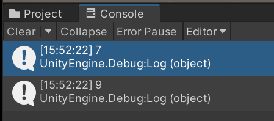

# Overview

`闭包（Closure）` 并非是 C# 特有的概念，关于 Closure 的学术定义如下：
```ad-cite
In computer science, a **closure** is a first-class function with free variables that are bound in the lexical environment.
```

其中一些概念的结束如下：

## First class function 
`First-class function` 表示可以被当作类成员变量的函数，C# 中可以通过委托实现 `First-class function`：
```csharp
Func<string,string> myFunc = delegate(string var1)
                                {
                                    return "some value";
                                };

```

同样可以使用 `lambda` 表达式实现 `First-class function`：
```csharp
Func<string,string> myFunc = var1 => "some value";
```

## Free Variables

`Free Variables` 表示在一个函数的实现中，既不是函数的形参也不是函数局部变量的其他变量。如下例子中的 `myVar` 即为 `Free Variables`：
```csharp
var myVar = "this is good";

Func<string,string> myFunc = delegate(string var1)
                                {
                                    return var1 + myVar;
                                };
```

## Example

如下例子展现了 `Closure` 的使用，其中 `inc` 为 [First class function](#First%20class%20function)，`myVar` 为 [Free Variables](#Free%20Variables)：
```csharp
private void Start()
{
    var inc = GetAFunc();
    Debug.Log(inc(5));
    Debug.Log(inc(6));
}

public static Func<int, int> GetAFunc()
{
    var myVar = 1;
    Func<int, int> inc = delegate (int var1)
                            {
                                myVar = myVar + 1;
                                return var1 + myVar;
                            };
    return inc;
}
```

该例子的输出结果为：


其中 `inc(5)` 的结果为 $7$ ，符合预期，而 `inc(6)` 的结果为 $9$ 而不是预期的 $8$。

这是因为 `myVar` 在第二次运行时的初始值并非是定义时的初始值 $1$ 而是第一次运行后的结果 $2$。

## How it works

对于上例中的 [Free Variables](#Free%20Variables) `myVar`，通常而言在运行完函数 `GetAFunc` 后就会从 Stack 中销毁。但正是因为 Closure 的存在，让其仍然能被 [First class function](#First%20class%20function) 访问。

Closure 的实现原理大致为：C# 编译器检测到委托中存在[Free Variables](#Free%20Variables) 时会生成一个全新的类实例，并将 [Free Variables](#Free%20Variables) 作为类的成员变量，而 [First class function](#First%20class%20function) 作为类的成员函数。

```ad-note
在上述例子中，第二次访问 `inc` 时的结果为 $9$，正是因为 `myVar` 变为了编译生成类的成员变量，所以第一次 `inc` 运行时相当于对成员变量进行了修改，而不是对函数内的局部变量进行修改。
```

需要注意的是，编译生成类实例时是将 [Free Variables](#Free%20Variables) 的变量本身作为类成员变量，而非将其数值作为成员变量。

因此如下的示例代码结果为 $1$ 而非 $0$，因此成员变量shi：
```csharp
int x = 0;
Action action = () => Debug.Log(x);
x = 1;
action();
```

# Reference
[A Simple Explanation of C# Closures](https://www.simplethread.com/c-closures-explained/)