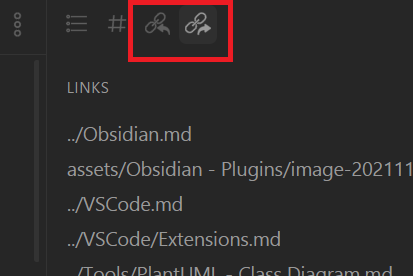
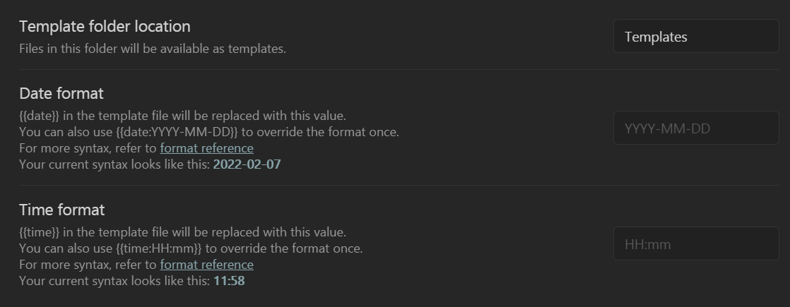
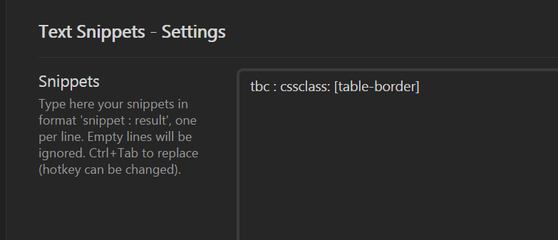

---
tags:
    - Obsidian
created: 2021-11-21
updated: 2022-02-07
---

在 `Settings/CorePlugins` 中选择启用或关闭 [Obsidian](../Obsidian.md) 官方的插件，在 `Settings/Community Plugins` 中安装和搜索社区的插件。

# Core Plugins

## Workspaces

该插件用来管理 Obsidian 的页面布局，当开启后可以在左侧边栏点开 `Manage workspaces` 图标，并在弹出的页面中保存或读取 workspaces。

## Tag Pane

该插件开启后，可以通过 `Tag pane: Show tag pane` 开启 Tab Pane，在其中会展示 Vault 中所有表示的 Tag。如下所示：


## Quick Switcher

该插件开启后，可通过默认为 `Ctrl+O` 的快捷键快速选择文件跳转，类似于 [VSCode](../VSCode.md) 中的 `Go to file (Ctrl + P)` 功能。

可在 `Settings/Quick switcher / Quick Switcher / Show attachments` 中选择跳转文件时，是否要展示附件文件。

## Random Note

该插件开启后，可以通过 `Random note: Open random note` 随机开启一个笔记

## Backlinks / Outgoing Links

 开启插件后，会在每个文档右侧面板中显示该引用了该文档的其他文档（Back Links）以及该文档引用的其他文档（Outgoing LinksS）
 

## Template

开启该插件后，可以通过选项 `Settings -> Templates` 设置模板存在的文件夹，如下所示将文件夹 `Teampltes` 设定为目标文件夹：


# Community Plugins

## Admonition[^1]

该插件用来为 Obsidian 增加 Admonition（Callout）功能，支持的类型参考 [Material for MkDocs](https://squidfunk.github.io/mkdocs-material/reference/admonitions/)

对于每个 Admonition 都必须以 `ad-` 开头。最简的使用格式如下：

<pre><code>```ad-note
Lorem ipsum dolor sit amet, consectetur adipiscing elit. Nulla et euismod nulla.
```</code></pre>

效果为：
```ad-note
Lorem ipsum dolor sit amet, consectetur adipiscing elit. Nulla et euismod nulla.
```

### 所有支持 Admonition 类型

上述的 `note` 为 `Admonition` 的类型，对于不同的类型会有不同颜色和不同图标的显示，所有支持的类型如下所示：

```ad-note
Lorem ipsum dolor sit amet, consectetur adipiscing elit. Nulla et euismod nulla.
```

```ad-abstract
Lorem ipsum dolor sit amet, consectetur adipiscing elit. Nulla et euismod nulla.
```

```ad-summary
orem ipsum dolor sit amet, consectetur adipiscing elit. Nulla et euismod nulla.
```

```ad-info
orem ipsum dolor sit amet, consectetur adipiscing elit. Nulla et euismod nulla.
```

```ad-todo
orem ipsum dolor sit amet, consectetur adipiscing elit. Nulla et euismod nulla.
```

```ad-tip
orem ipsum dolor sit amet, consectetur adipiscing elit. Nulla et euismod nulla.
```

```ad-hint
orem ipsum dolor sit amet, consectetur adipiscing elit. Nulla et euismod nulla.
```

```ad-important
orem ipsum dolor sit amet, consectetur adipiscing elit. Nulla et euismod nulla.
```

```ad-success
orem ipsum dolor sit amet, consectetur adipiscing elit. Nulla et euismod nulla.
```

```ad-check
orem ipsum dolor sit amet, consectetur adipiscing elit. Nulla et euismod nulla.
```

```ad-done
orem ipsum dolor sit amet, consectetur adipiscing elit. Nulla et euismod nulla.
```

```ad-warning
rem ipsum dolor sit amet, consectetur adipiscing elit. Nulla et euismod nulla.
```

```ad-caution
orem ipsum dolor sit amet, consectetur adipiscing elit. Nulla et euismod nulla.
```

```ad-attention
orem ipsum dolor sit amet, consectetur adipiscing elit. Nulla et euismod nulla.
```

```ad-failure
rem ipsum dolor sit amet, consectetur adipiscing elit. Nulla et euismod nulla.
```

```ad-fail
orem ipsum dolor sit amet, consectetur adipiscing elit. Nulla et euismod nulla.
```

```ad-missing
orem ipsum dolor sit amet, consectetur adipiscing elit. Nulla et euismod nulla.
```

```ad-danger
rem ipsum dolor sit amet, consectetur adipiscing elit. Nulla et euismod nulla.
```

```ad-error
orem ipsum dolor sit amet, consectetur adipiscing elit. Nulla et euismod nulla.
```

```ad-bug
orem ipsum dolor sit amet, consectetur adipiscing elit. Nulla et euismod nulla.
```

```ad-example
rem ipsum dolor sit amet, consectetur adipiscing elit. Nulla et euismod nulla.
```

```ad-quote
orem ipsum dolor sit amet, consectetur adipiscing elit. Nulla et euismod nulla.
```

```ad-cite
orem ipsum dolor sit amet, consectetur adipiscing elit. Nulla et euismod nulla.
```
### 自定义 Admonition

对于 Admonition 可以自定义标题，是否支持折叠，图标和颜色，如下所示：

```ad-note
title: Custom Title $\sum\frac{\pi}{\sigma}$
collapse: open
icon: triforce
color: 200, 200, 200

Lorem ipsum dolor sit amet, consectetur adipiscing elit. Nulla et euismod nulla.
```

可以在 `Settings\Plugin Options\Admonition\Collapsible by Default` 选择是否默认折叠 Admonition.

所有 Icon 必须来自于 [FontAwesome](https://fontawesome.com/) 或 [RpgAwesome](https://nagoshiashumari.github.io/Rpg-Awesome/)

### 嵌套 Admonition

当需要嵌套 Admonition 时，可以为外部的 Admonition 加入更多的 \`，如下所示：
<pre><code> `````ad-note
title: Nested Admonitions
collapse: open

Hello!

````ad-note
title: This admonition is nested.
This is a nested admonition!

```ad-warning
title: This admonition is closed.
collapse: close
```
````

This is in the original admonition.
`````</code></pre>

效果如下：

`````ad-note
title: Nested Admonitions
collapse: open

Hello!

````ad-note
title: This admonition is nested.
This is a nested admonition!

```ad-warning
title: This admonition is closed.
collapse: close
```

````

This is in the original admonition.
`````

还可使用 Python 风格的 Markdown如下的代码实现嵌套 Admonition：

<pre><code>```ad-note
title: Nested Admonitions
collapse: open

Hello!

!!! ad-note
    title: This admonition is nested.
    This is a nested admonition!
    !!! ad-warning
        title: This admonition is closed.
        collapse: close

This is in the original admonition.
```</code></pre>

效果如下：

```ad-note
title: Nested Admonitions
collapse: open

Hello!

!!! ad-note
    title: This admonition is nested.
    This is a nested admonition!
    !!! ad-warning
        title: This admonition is closed.
        collapse: close

This is in the original admonition.
```

#### 嵌套代码块

当需要在 Admonition 中嵌套代码块时，可以用更多的 \` 表示，也可以用则需要使用 `~~~` 表示：

<pre><code> ````ad-info

```ad-bug
title: I'm Nested!
~~~javascript
throw new Error("Oops, I'm a bug.");
~~~
```

```javascript
console.log("Hello!");
```

````</code></pre>

效果如下：

````ad-info

```ad-bug
title: I'm Nested!
~~~javascript
throw new Error("Oops, I'm a bug.");
~~~
```

```javascript
console.log("Hello!");
```

````

## Custom Attachment Location[^2] 

该插件控制在
Obsidian 中插入图片后图片资源存储地址，效果类似于 VSCode 中的插件 [Extensions](../VSCode/Extensions.md)

当安装完成后，可直接通过 `Ctrl+V` 在界面中以 markdown 格式黏贴图片，图片的源文件会被保存在 `./asset/` 目录下的与文件同名的子文件夹下。

具体的保存路径可以在 `Settings/Custom Attachment Location` 中进行配置。

## PlantUML[^3]

该插件实现在 Obsidian 中插入 [PlantUML](../Tools/PlantUML%20-%20Class%20Diagram.md) 的功能。

其中将 PlantUML 的代码定义在 `plnatuml` 代码块中，如下所示：
<pre><code> ````plantuml

A --> B

````</code></pre>

效果如下：
````plantuml

A --> B

````

```ad-note
为了编写的 PlantUML 代码可以同时在 VSCode 中展示，推荐使用如下的格式：
<pre><code> ````plantuml
@startuml
A --> B
@enduml
````</code></pre>
```

## Better Footnote [^4]

该插件支持更好的展示脚注。在下载打开该插件后，当光标移动到文中的脚注部分，会在 PopOver 窗口中显示对应的脚注，如下所示：


默认安装插件后，脚注的内容就不会在文章中显示，可以通过 `Settings/Better footnote\Show reference` 重新打开显示。

## Quick Explorer[^5]

该插件实现了文件夹目录的快速访问如下所示：


## Tag Wrangler[^6]

该插件增强了 [Tag Pane](Plugins.md#Tag%20Pane) 的功能，主要提供了为 [Tag](Tag.md) 重命名的功能。

当安装插件后，在 Tag Panel 中右键 Tag 会展现出重命名的选项。

## Sliding Panes[^7]

Obsidian 中默认打开一个页面时，会覆盖当前 Pane 的内容，该插件实现了自动在新页面打开并将多个页面折叠滑动的效果，如下所示：


可以在快捷键中设置 `Focus on Pane to the left` 和 `Focus on Pane to the right` 命令向左或向右切换 Pane。

## Advanced Tables [^8]

该插件帮助可以更快的插入表格。

## File Explorer Note Count[^9]

该插件实现在文件夹侧面显示该文件夹中笔记的数量，如下所示：


## Obsidian Git[^10]

该插件用来自动定义将 Obsidian Vault 中内容通过 Git 备份。

在使用前需要在 Vault 文件夹中先初始化 Git，如果需要推送至远端也需要先将远端地址设置好，插件并不会自己配置 Git 环境等。

通过 `Settings/Obsidian Git` 可以为插件进行配置，如每隔多少分钟进行一次备份，备份时是否需要将 Commit 推送至远端等。

该插件也提供了一系列快捷键选项，如下所示：


## Emoji Toolbar[^11]

该插件用来支持插入 Emoji，安装插件后可为命令 `Emoji Toolbar: Open emoji picker` 设定快捷键（此设为 `Ctrl+;`），当使用快捷键时打开插入 Emoji 的界面，如下所示：


## Relative-line-numbers[^12]

该插件用来支持在 Editor 模式下显示相对行号。

```ad-fail
该插件不支持同时显示绝对行号和相对行号
```

##  盘古[^13]

自动在中文与英文以及中文与数字见添加空格。

安装插件后，可以为 ` 盘古：为中英文字符间自动加入空格 ` 设置快捷键，并在文本输入后通过快捷键进行格式化。

## Word Splitting for Simplified Chinese in Edit Mode[^14]

该插件解决 Obsidian 中双击选中中文分词时错误效果的问题，在 Obsidian 默认的实现中会错误的将一整个中文短语作为单词被选中，安装插件前后的效果如下所示：

| Obsidian 默认中文分词                                    | 插件中文分词                                            |
| -------------------------------------------------------- | ------------------------------------------------------- |
|  |  |


## Vimrc Support[^15]

该插件让 Obsidian 支持 Vim 配置文件，该文件需要命名为 `.obsidian.vimrc`，且放在 Vault 根目录（并非 `.obsidian` 文件夹）。

配置的示例如下所示：
```text
noremap j gj
noremap k gk

noremap H ^
noremap L $

set clipboard=unnamed
```

也可以使用如下的方法，配置 [Commands](Commands.md)：
```text
exmap back obcommand app:go-back
nmap <C-o> :back
```

该插件目前不支持设置 Leader 来触发命令，但可以使用 `<Space>`，但使用前必须先指明 `unmap <Space>`，使用示例如下所示：
```text
unmap <Space> " Require by <Space>

exmap search obcommand editor:open-search
nmap <Space>ff :search
```

## Icon Folder [^16]

该插件可以为文件和文件夹前添加 Icon。

安装插件后，可以在文件夹/文件右键选择 `Change Icon` 为文件夹/文件添加 Icon。

在 `Settings/Icon Folder` 中选择支持的 Icon 库，如下所示：


可以右键选择 `Inherit Icon`，当选择了 `Inherit Icon` 后所有该文件夹下的文件都会自动添加按钮。

在 `Change Icon` 和 `Inherit Icon` 的页面中，也可以按下 `Windows + ;` 打开 Windows 自带的 Emoji 库。当选择好 `emoji` 后，选择 `Use twemoji emoji` 技能输入，如下所示：


## Automatically Reveal Active File [^17]

在  Obsidian 中打开文件时，文件不会在左侧的 File Explorer 中高亮。

可以使用命令 `File explorer: Reveal active file in navigation` 在 File Explorer 中高亮打开的文件。

该插件安装后，会在打开每个文件时自动触发上述命令，达到打开文件时在 File Explorer 自动高亮的效果。

## Quick Add[^18]

该插件可以用来快速添加笔记模板，其中模板依赖于 Core Plugins [Template](#Template)。

启用该插件后，可以在 `Settings/QuickAdd` 页面添加增加快速通过模板创建笔记的命令，如下：


添加后，可以配置新增的命令并设定该命令依赖的额模板，如下：


## Text Snippets[^19]

该插件可以用来快速输入 Snippets。

启用该插件后，可以在 `Settings/TextSnippets` 中设置需要替换的 Snippets，如下所示：


此时，当输入了 `tbc` 并按下 `Ctrl-Tab` 后，`tbc` 会被替换为 `tbc : cssclass: [table-border]`，如下所示：


```ad-tip
`Ctrl-Tab` 为 `Text Snippets: Run snippet replacement` 命令的默认按键，可以在 `Settings/Hotkeys` 中进行修改。
```

```ad-error
在 Obsidian 0.13.23 版本下使用该插件 0.0.6 版本会存在无法替换 Snippets 的问题，可以通过对 `.obsidian\plugins\text-snippets-obsidian\main.js` 进行如下修改修复：
~~~js
@@ -97,12 +99,12 @@ class TextSnippets extends obsidian.Plugin {
     getWordBoundaries(editor) {
         var cursor = editor.getCursor();
         var line = cursor.line;
-        var word = editor.findWordAt({
+        var word = editor.wordAt({
             line: line,
             ch: cursor.ch
         });
-        var wordStart = word.anchor.ch;
-        var wordEnd = word.head.ch;
+        var wordStart = word.from.ch;
+        var wordEnd = word.to.ch;
         return {
             start: {
                 line: line,
~~~
```

# Reference

[^1]: [Admonition](https://github.com/valentine195/obsidian-admonition)
[^2]: [Custom Attachment Location](https://github.com/RainCat1998/obsidian-custom-attachment-location)
[^3]: [PlantUML](https://github.com/joethei/obsidian-plantuml)
[^4]: [Better Footnote](https://github.com/aidenlx/better-fn)
[^5]: [Quick Explorer](https://github.com/pjeby/quick-explorer)
[^6]: [tag-wrangler](https://github.com/pjeby/tag-wrangler)
[^7]: [Sliding Panes](https://github.com/deathau/sliding-panes-obsidian)
[^8]: [Advanced Tables](https://github.com/tgrosinger/advanced-tables-obsidian)
[^9]: [File Explorer Note Count](https://github.com/ozntel/file-explorer-note-count)
[^10]: [obsidian-git](https://github.com/denolehov/obsidian-git)
[^11]: [obsidian-emoji-toolbar](https://github.com/oliveryh/obsidian-emoji-toolbar)
[^12]: [obsidian-relative-line-numbers](https://github.com/nadavspi/obsidian-relative-line-numbers)
[^13]: [Obsidian-Pangu](https://github.com/Natumsol/obsidian-pangu)
[^14]: [Obsidian-Word Splitting for Simplified Chinese in Edit Mode](https://github.com/aidenlx/cm-chs-patch)
[^15]: [obsidian-vimrc-support (github.com)](https://github.com/esm7/obsidian-vimrc-support)
[^16]: [FlorianWoelki/obsidian-icon-folder:](https://github.com/FlorianWoelki/obsidian-icon-folder)
[^17]:[Automatically Reveal Active File](https://github.com/shichongrui/obsidian-reveal-active-file)
[^18]: [QuickAdd for Obsidian](https://github.com/chhoumann/quickadd)
[^19]:[text-snippets-obsidian](https://github.com/ArianaKhit/text-snippets-obsidian)
