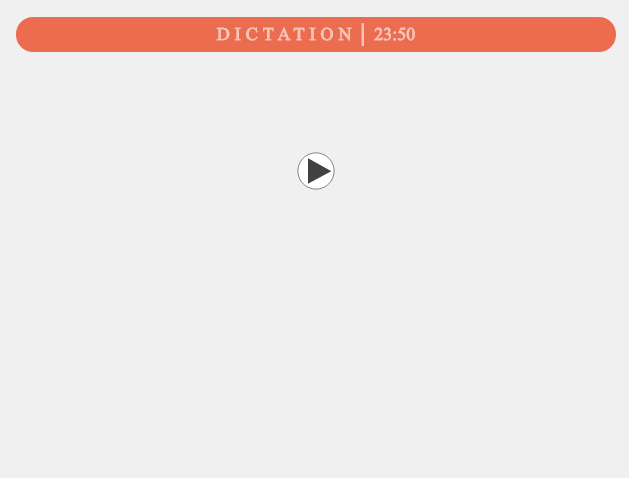

---
tags:
    - Tool
created: 2022-01-30
updated: 2022-01-30
cssclass: [table-border]
---

# 单词卡片模板

该模板有三种模式：分别是 `听写测试（Dictation）` ， `拼写测试（Spelling）` 和 `背诵 （Recite）`

## 听写测试

|                               |                                   |
| ----------------------------- | --------------------------------- |
|  |  |

正面播放音频，背面显示完整内容

## 拼写测试

|                                       |                                       |
| ------------------------------------- | ------------------------------------- |
|  |  | 

正面显示单词含义，并要求拼写正确，背面显示拼写结果和例句

## 背诵

|                                       |                                       |
| ------------------------------------- | ------------------------------------- |
|  |  | 

正面显示单词及读音，背面显示完整内容

# 自动补全卡片信息

使用插件：[Fast Word Query: Multi-threaded queries for words from local or web dictionaries](https://ankiweb.net/shared/info/1807206748)

在浏览界面可打开 `FastWQ` 的设置

其中可以指定为卡片的不同字段用不同的词典搜索
