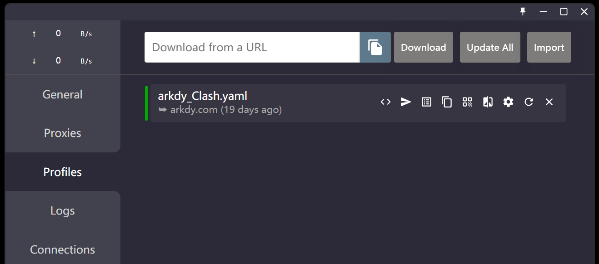
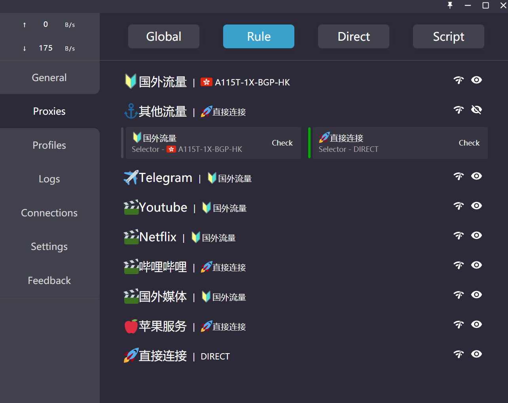

---
tags:
    - Tool
created: 2022-02-07
updated: 2022-02-07
---

# Installation

可通过 [Chocolatey](Chocolatey.md) 进行安装：
```shell
choco install --yes clash
```

# Configuration

可通过 `Profiles` 页面下载配置文件：


## Global / Rule

可以为 Clash 设置全局代理或规则代理，在全局代理的情况下理论上所有的网络访问都会走代理，规则代理的情况下，则会按照设定的规则选择走或不走代理进行访问。规则代理的示意图如下所示：


可以通过如下的入口添加：


关于添加的 Rule 的规则，可参考：
[规则编辑 | Clash for Windows (lbyczf.com)](https://docs.cfw.lbyczf.com/contents/ui/profiles/rules.html)

# FAQ

## UWP 应用无法走代理

几乎所有 UWP 应用（如系统的 Mail，Microsoft Store 等）在使用了 Clash 后都无法进行访问。

这是因为代理需要首先需要应用访问回环地址（127.0.0.1），而默认情况下 UWP 应用会禁止使用回环地址。

为了解决这个问题，需要关闭 UWP 应用无法访问hui'hua
