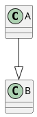
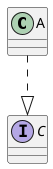
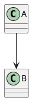
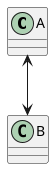
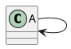
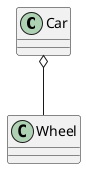
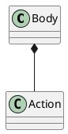

# 类元素的定义

可通过如下的关键字定义类的元素：`abstract class`, `class`, `enum`, `interface`。


# 类之间的关系

类之间的关系包含以下几种：
1. `泛化（Generalization）`：`--|>`
2. `实现（Realization）`：`..|>`
3. `依赖（Dependency）`：`..>`
4. `关联（Association）`
5. `组合（Composition）`
6. `聚合（Aggregation）`

* `泛化` 和 `实现` 是 `类层级（Class-Level）` 之间的关系
* `依赖`，`关联`，`组合`，`聚合` 是 `类对象层级（Instance-Level）` 之间的关系。

```ad-note
在某些定义下，`关联`，`组合`，`聚合` 统称为 `关联`
```

## 泛化

`泛化`表示的是子类与父类之间继承关系。

在 PlantUML 中通过 `--|>` 表示，其中箭头指向的对象表示被继承的对象。如下表示 A 继承 B：


## 实现

`实现`表示的是接口与类之间的实现关系。

在 PlantUML 中通过 `..|>` 表示，其中箭头指向被实现的对象。如下表示 A 实现了 C：


## 依赖

`依赖`表示对象之间临时的联系，如 A 类对象中中使用了 B 类对象作为参数，局部变量或对 B类有静态方法的调用。

在 PlantUML 中通过 `..>` 表示，其中箭头指向的对象，表示被依赖的对象。如下表示 A 依赖于 B：


## 关联

`关联` 表示对象之间的引用关系，如 A 类对象中用到了 B 类的对象作成员变量。

在 PlantUML 中通过 `-->` 表示，其中箭头指向的对象，表示被关联的对象。如下表示 A 类对象中关联了 B 类对象：


当两个类的对象互有关联时，可以使用 `<-->` 表示，如下所示：


一个类的对象，也可以关联自身。这种情况通常在单例模式中出现：




## 聚合

`聚合` 表示对象之间 `has-a` 的关系，即两个对象之间表现出一种 `整体-部分`的状态。其中部分并不依赖与整体，可独立存在。

如汽车与轮胎就是一种聚合关系，因为轮胎是汽车的一部分，同时轮胎又可以单独作为商品。

PlantUML 中通过 `o--` 表示聚合关系，其中 `o` 靠近的一方表示整体，如下所示：


## 组合

`组合`表示对象之间 `contains-a` 的关系，即两个对象之间表现出一种 `整体-部分`的状态。其中部分依赖与整体，不可独立存在。

如身体和动作是一种组合关系，因为没有了身体的存在，动作也就没有了意义。

PlantUML 中通过 `*--` 表示组合关系，其中 `*` 靠近的一方表示整体，如下所示：
