# Overview

`RectTransform` 是 Transform 对应的 2D Component，`RectTransform` 用来定义 UI 元素的位置，旋转，大小等信息，所有信息都会基于父物体得到。

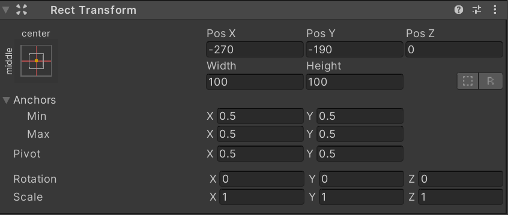

# Anchors

`Anchors` 用于父子物体的对齐，一个物体的 `Anchors` 表示它需要与父物体的哪个区域相对齐。其在 Inspector 面板和 Scene 界面中分别如下表达：

|                                                                |                                                            |
| -------------------------------------------------------------- | ---------------------------------------------------------- |
| 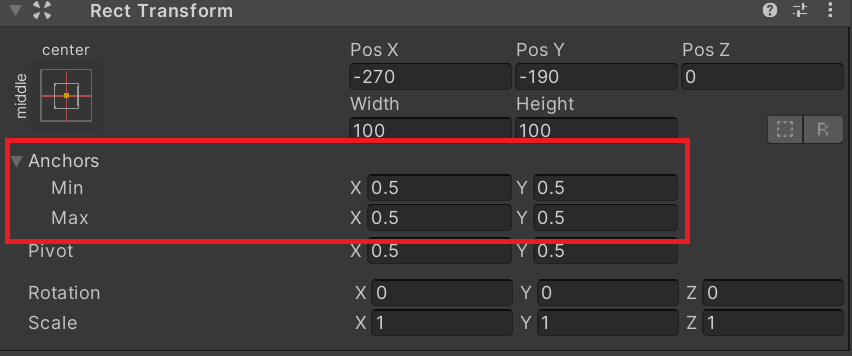 | 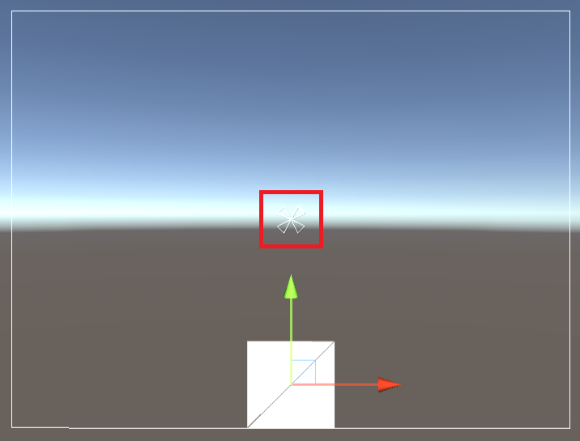 |

在 Inspector 中 `Anchors` 通过 `Anchor Max` 及 `Anchor Min` 定义，`Anchors` 的四个点都可以根据这两个点算出。如下所示：
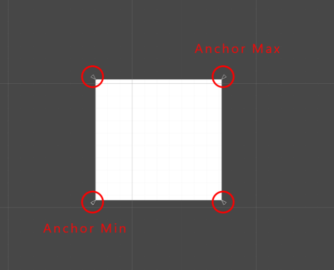

当使用鼠标拖动表示 `Anchor` 点的三角形时，Unity 会显示 `Anchors` 基于父物体的比例关系：


```ad-note
`Insepctor`中的值即为该比例关系的归一化数值。
```

针对 `Anchor Max` 和 `Anchor Min` 值相同与不同的情况，Unity 会使用绝对或相对布局计算子元素的位置，对应的 Inspector 面板也不同，如下所示：

|                                                               |                                                               |
| ------------------------------------------------------------- | ------------------------------------------------------------- |
| 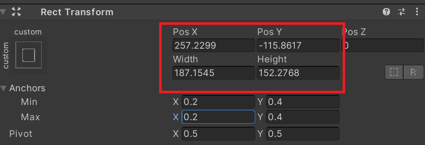 | 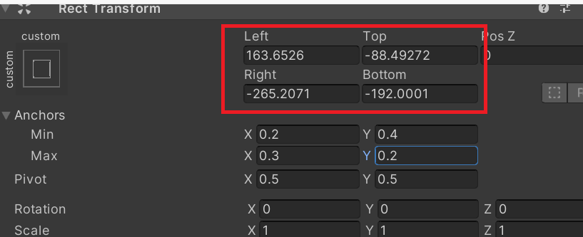 |

绝对和相对布局可以针对单一的轴向，如下情况 `Anchor Max` 和 `Anchor Min` 的 X 轴值不同，Y 轴值相同，因此 X 轴为相对布局，Y 轴为绝对布局：
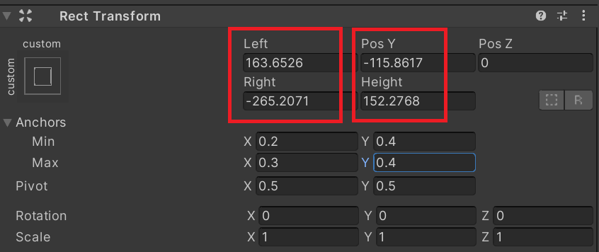

## 绝对布局

绝对布局的情况下，四个 `Anchors` 表示的是同一个点。 `width` 和 `height` 即为当前 UI 元素的宽和高，且该宽高与父物体无关。即无论父物体的大小，当前 UI 的宽高都是不变的。

`Pos X/Y/Z` 三个值表示该 UI 元素的 [Pivot](#Pivot) 距离 `Anchors` 点的距离。

如当物体的 `Anchor Max` 与 `Anchor Min`   都为 $(0.5,0.5)$，此时它会与父物体的 $(0.5,0.5)$ 点对齐。如下所示，无论父物体如何变化，子物体与 $(0.5,0.5)$ 点的关系都不会变，子物体的尺寸也不会变化：
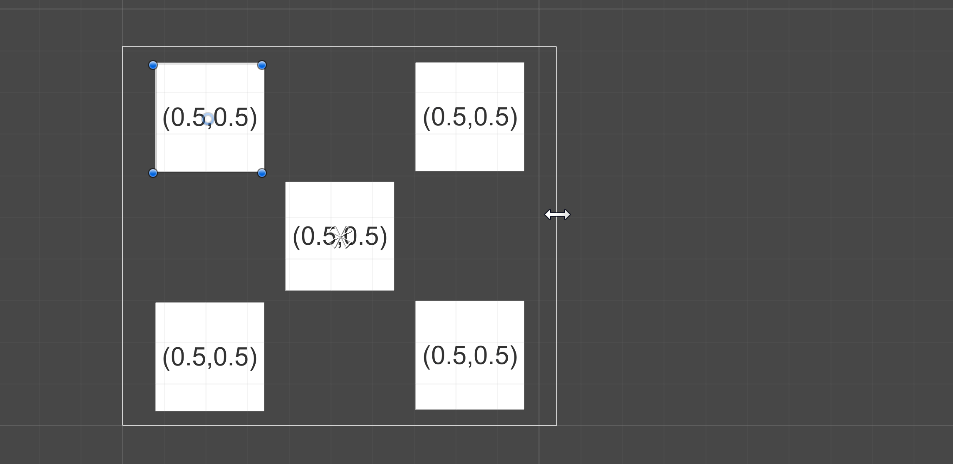

当 `Anchor Max` 与 `Anchor Min`   都为 $(0.0,1.0)$ 时，子物体与父物体的左上角对齐，如下所示：
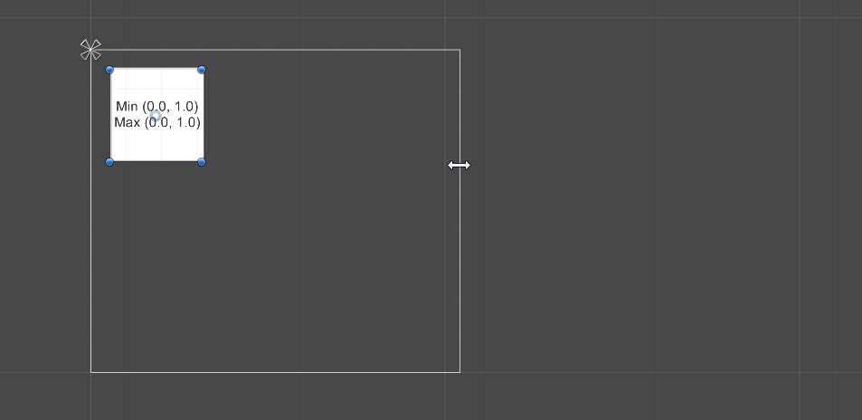


## 相对布局

当相对布局时，`Left / Top / Right / Bottom` 分别表示 UI 元素的 `左/上/右/下` 边缘距离锚点所构成的 `左/上/右/下` 的距离。

效果如下所示：

|     |     |
| --- | --- |
|  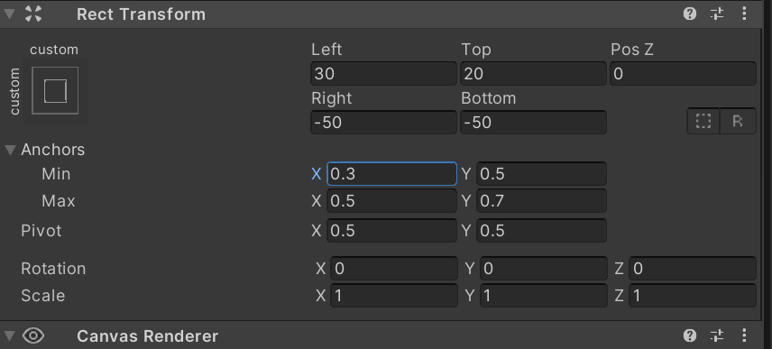  |  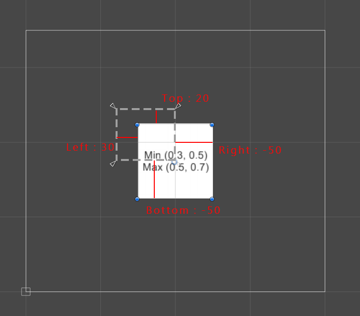  | 


当 `Anchor Min` 值为 $(0.0,0.0)$ ，`Anchor Max` 值为 $(1.0,0.0)$ 时，子物体会对齐物体的父物体的左下角和右下角，在这种情况下，如果改变父物体的宽度，子物体的宽度也会一同变化，如下所示：
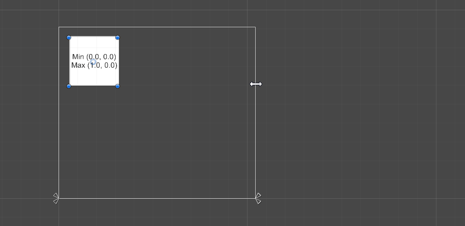

## Anchor Presets

点击 RectTransform 左上角，可以开启 `Anchor Presets` 界面，界面中列出了常用的 `Anchor`：
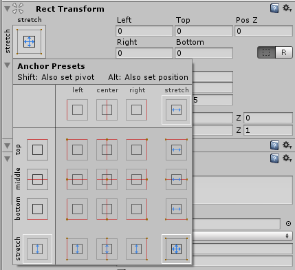


# Pivot

`支点（Pivot）` 用来影响当前物体旋转，缩放及修改位置的支点。当选择了 `Rect Tool` 和 `Pivot` 时，`Pivot` 会在 Scene 中以蓝色空心小圈显示：

|                                                       |                                                       |
| ----------------------------------------------------- | ----------------------------------------------------- |
| 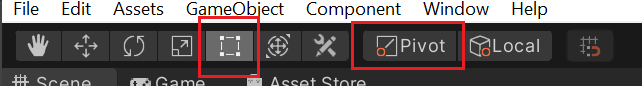 | 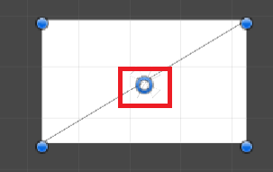 |

当 `Pivot` 为 $(0.5,0.5)$ 时，缩放与旋转都基于物体的中心点，如下所示：
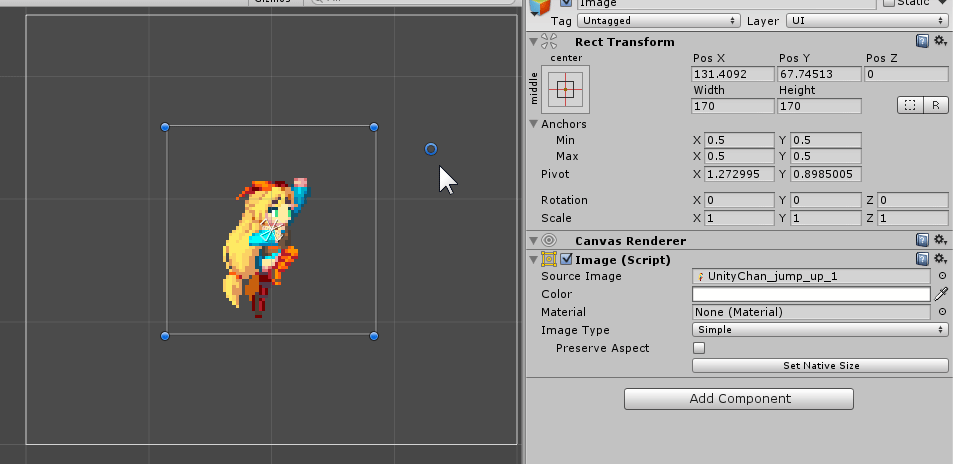

当 `Pivot` 为 $(0,1)$ 时，缩放与旋转则会基于物体的左上角，如下所示：
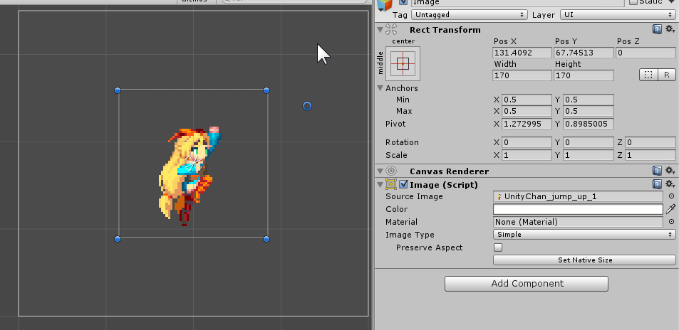

# Blur Print Mode

蓝图模式通过在 `RectTransform` 的如下按钮启用：
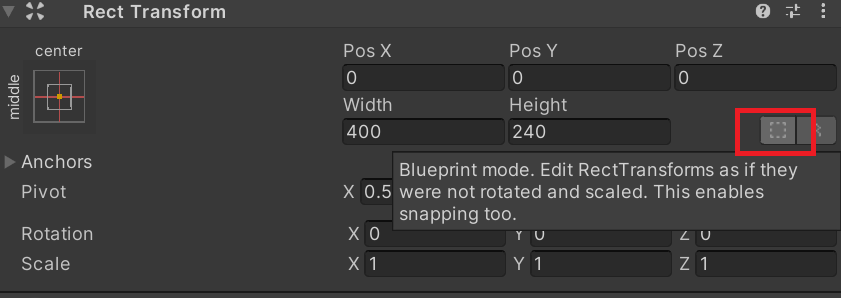

当蓝图模式开启后