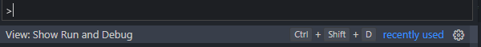
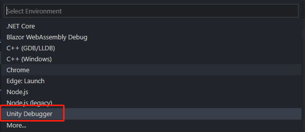
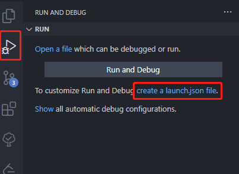
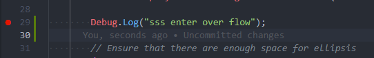
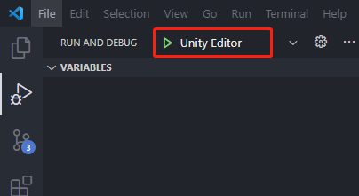
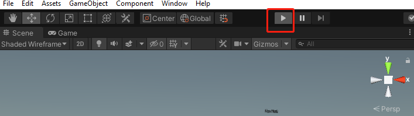
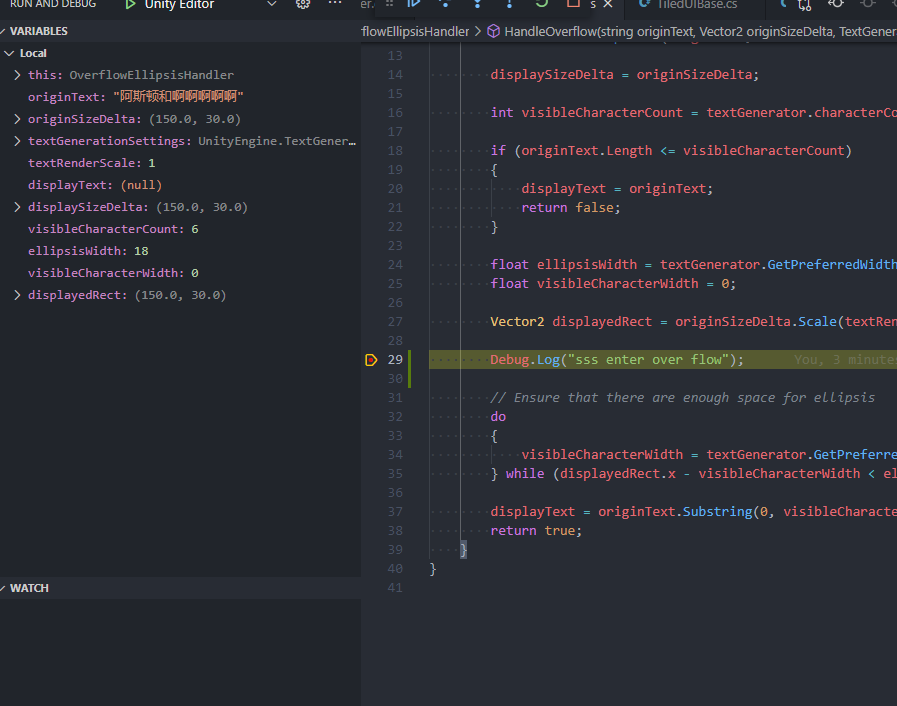

# Debugger

## Pre-Requirement

首先在 VSCode 中安装插件 `Debugger for Unity` 。

然后进入 VSCode 的 `Run and Debug` 面板，该面板可通过命令 `View: Show Run and Debug` 命令开启：


在 Run and Debug 面板中选择 create a launcher.json file 创建 VSCode 的调试配置文件：




至此，使用 VSCode 调试 Unity 的所有前置条件完成。

## Connect to Editor

在 VSCode 中对目标语句打上断点：


在 VSCode 中运行调试器：


然后在 Unity Editor 中运行游戏：


VSCode 会自动在断点处停下：


## Connect to Android

`Debugger for Unity` 插件从界面上看可以连接 Android 设备并调试，但在实际测试中，会出现无法搜索到安卓应用进程的问题，即在连接阶段会卡在[^1]：

```powershell
UnityDebug: Initializing
UnityDebug: Searching for Unity process 'Android Player'
```

# Reference

[^1]:[Debugging android device](https://github.com/Unity-Technologies/vscode-unity-debug/issues/44#issuecomment-503430808)