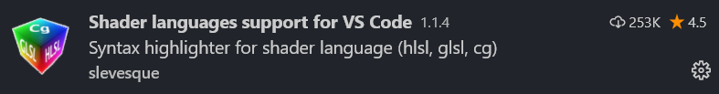

# 语法高亮

安装 `Shader languages support` 插件



# 格式化

安装 `Clang-Format` 插件


安装完后需要运行在命令行中运行如下语句，安装依赖的 `clang-format`

```bash
npm install -g clang-format
```

```ad-note
`npm` 可以通过 [Chocolatey](../Tools/Tools%20-%20Chocolatey.md) 安装。
~~~shell
choco install —yes nodejs
~~~
```

默认的 `clang` 中对于GLSL的格式化，是两个空格的缩进及大括号不换行，可以通过在 `settings.json` 加上如下语句，将风格改为4个空格的缩进和大括号换行。

```json
"clang-format.language.glsl.style": "Microsoft"
```

# Reference

[Writing Shaders in VS Code: GLSL Setup | by Berrak Nil | Medium](https://medium.com/@berraknil/writing-shaders-in-vs-code-glsl-setup-391948580a9a)